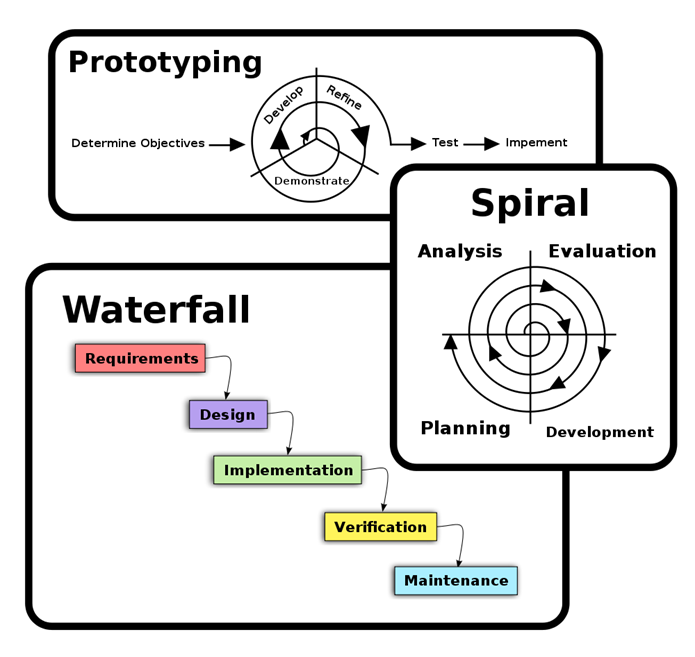
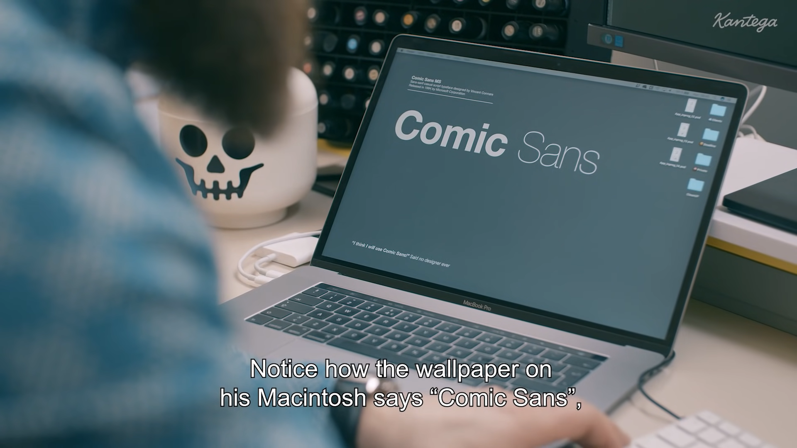
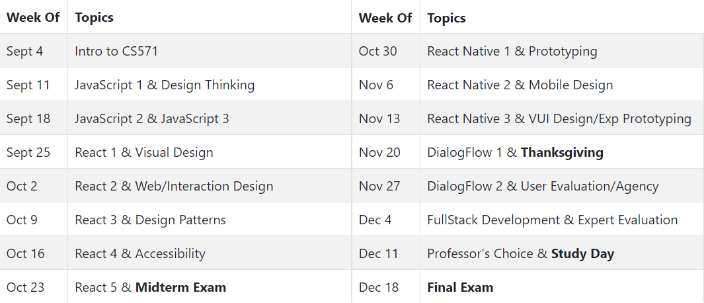
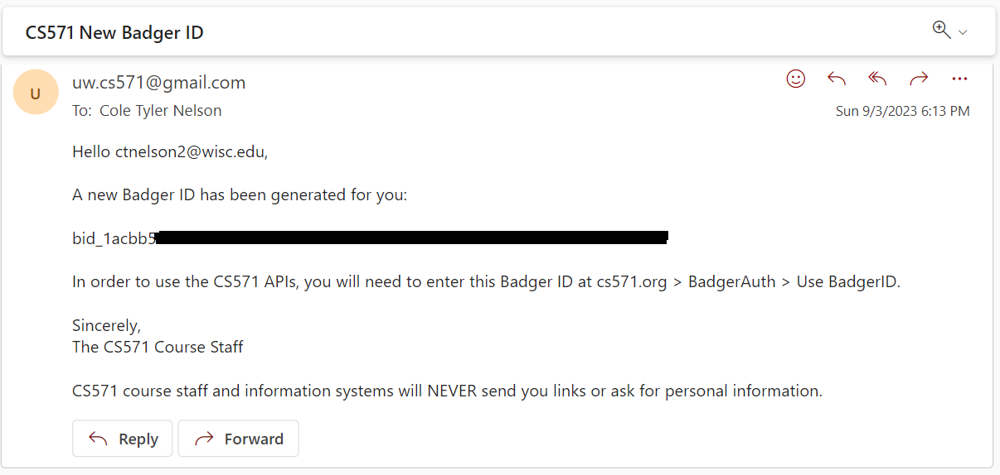
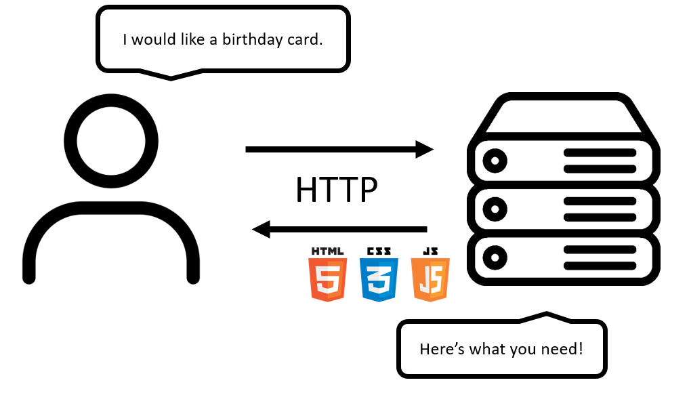
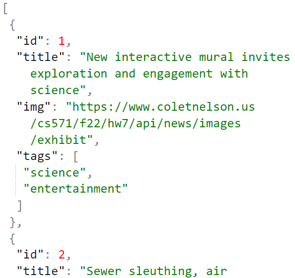
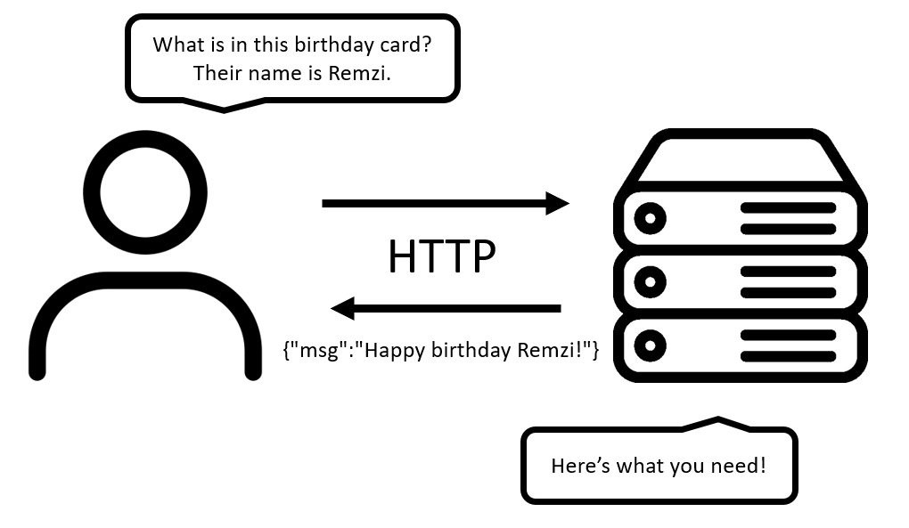
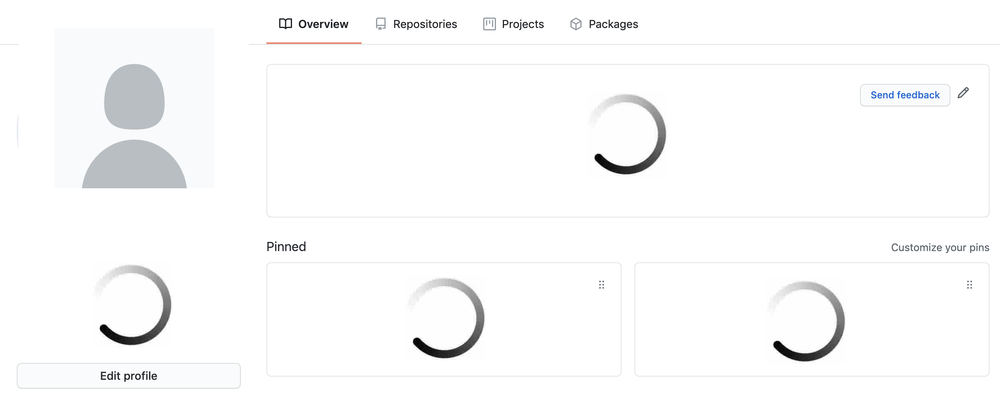
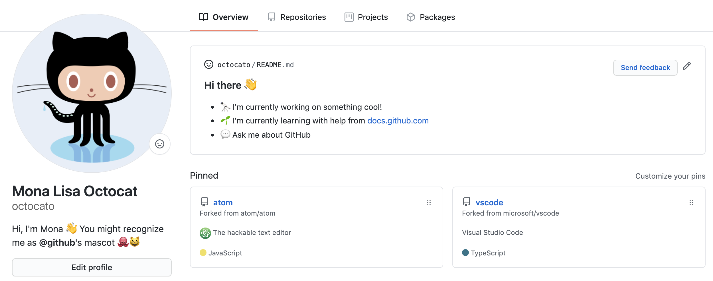

 

# **Welcome to CS571!**
## Building User Interfaces

 

#### Cole Nelson & Professor Yuhang Zhao

---

What is this course about?

 

# UX Development

 

 ...but what is UX Development?

---

The realm of the UX developer exists <b>somewhere between that of the traditional developer and the designer</b>. We’re not really designers, yet to be a good UX developer you certainly need to have an eye for design. In the same vein, we’re not traditional developers but we certainly need to have development experience and expertise. Often this experience spans multiple technologies, languages, and platforms.

 ###

 — Tim R. Todish

---

It falls on <b>the UX developer to bridge the gap between design and technology</b>. We need to be able to think and speak the language of designers. It’s our job to help translate their vision to the development team in a way that they can understand and accept. This can be a critical piece of the puzzle in a project, especially if the design and the interactions behind it are complex.

###

 — Tim R. Todish

---

Similarly, we need to speak on behalf <b>the developers to help reign in the designers</b>, at times. If they are coming up with concepts that will be extremely difficult or time consuming to implement, we can explain the limitations of the technology and the complexity involved in implementing their designs, and try to come up with an acceptable alternative.

###

 — Tim R. Todish

---

# **UX Development**
## = Software Engineering +
## UX Design

---

# What does a **Software Engineer** do?

---

[Kantega | The Mysterious Life of Developers](https://www.youtube.com/watch?v=ocwnns57cYQ)

---

<b>Definition:</b> A software engineer is a person who applies the principles of software engineering to the design, development, maintenance, testing, and evaluation of computer software.

How does a Software Engineer go about this?

[What is a Software Engineer?](https://en.wikipedia.org/wiki/Software_engineer)

---

### Software Development Lifecycle

[SDL Process](https://en.wikipedia.org/wiki/Software_development_process)

---

# What does a **UX Designer** do?

---

[Kantega | The Mysterious Life Of UX Designers](https://www.youtube.com/watch?v=gfHcnig8Lo4)

---

<b>Definition:</b> User experience (UX) design is the process that design teams use to create products that provide meaningful and relevant experiences to users.  A UX designer is concerned with the entire <i>process</i> of acquiring and integrating a product, including aspects of branding, design, usability, and function.

###

How does a UX designer go about this?

###
[Interaction Design Foundation](https://www.interaction-design.org/literature/topics/ux-design)

---

### UX Design Process
Look familiar?

[NN/g Design Thinking](https://www.nngroup.com/articles/design-thinking/)

---

# So then, what is **UX Development**?

---

[Don Norman: The term "UX"](https://www.youtube.com/watch?v=9BdtGjoIN4E&t=9s)

---

<h3>UX Development Trajectories</h3>

 - One-person development team to build full-stack applications
 - A developer who speaks the language of the designers
 - A designer who can also build native prototypes
 - A bridge/translator between designers and developers in large/complex organizations

---

# Course Details

---

### Co-Instructors

###

Cole Nelson
**ctnelson2@wisc.edu**

###

Prof. Yuhang Zhao
**yuhang.zhao@cs.wisc.edu**

 
 

---

### TAs

 - Amy Koike
 - Zach Potter
 - Ru Wang
 - Leo Cui
 - Ruijia Chen
 - Hongtao Hao
 - Nithin Weerasinghe

---

### Peer Mentors

 - Tom Rosen
 - Xinyu Li
 - Wai Linn
 - Josh Charpentier
 - Dante Smith
 - Alicia Lyu
 - Christopher Plagge

---

## Who are you?
We'll get to know you in HW0! This information will be shared with your classmates in HW2 & HW4, BadgerBook.

---

<h3>Course Information</h3>

 - Meet Tuesdays & Thursdays; lectures will be recorded and posted to Kaltura.
   - In-person attendance is *encouraged*.
 - Tuesday's lecture will cover programming topics, Thursday's lecture will cover fundamental human-computer interaction topics.
- Bring a laptop!

---

---

| Item | Points | Notes |
| - | - | - |
| Weekly Assignments | 54 | 10 HWs (5 pts) & 3 HWs (1-2 pts each) |
| Weekly Quizzes | 11 | 12 quizzes, 1 pt each, lowest dropped |
| Midterm Exam | 15 | Single-sided notesheet |
| Final Exam | 20 | Double-sided notesheet |

###### Point Distribution

| A | AB | B | BC | C | D | F
| --- | --- | --- | --- | --- | --- | --- |
| [100, 93] | (93, 88] | (88, 80] | (80, 75] | (75, 70] | (70, 60] | (60, 0]

###### Grading Scale

---

### Weekly Assignments & Quizzes
 - Keep up with the lectures & course content!
   - Concepts build throughout the semester.
 - Every weekly assignment and quiz is due on Monday at 11:59 pm.
   - Assignments are released on Tuesday.
   - Quizzes are released on Thursday.

 ---

### Midterm & Final Exam

 - Exams will be held *in-person*.
   - A Canvas/HonorLock alternative will be provided for those unable to make the exam.
 - Midterm Exam
   - Thursday, October 26th @ 5:45 pm on-campus
 - (Cumulative) Final Exam on Finals week.
 - See Canvas for past exams.

---

### Late Policies
 - Weekly quizzes may *not* be submitted late.
 - Weekly assignments may be turned in *up to* one week (7 days) late with the following restrictions...
   - Each late day is 10% off the assignment grade.
     - e.g. a score of 4.5/5.0 two days late is a 3.6.
   - Days are *rounded up*, e.g. 12:01 am is a late day.
   - The first 10 late days used are penalty-free.
     - These are intended to be used in case of sickness or extenuating circumstances.

---

### Academic Integrity
 - **Do not share code with others!**
 - **Do not use code from previous semesters!**
 - You may *discuss* assignments with others, but all work must be done individually.
 - Snippets taken from StackOverflow, ChatGPT, etc. must be cited with a comment.
 - We use tools like MOSS... Don't risk it!

---

### Course Tools

 - Quizzes will be completed via *Canvas*. They are open-book, but must be completed individually.
 - Assignments will be submitted via *GitHub Classroom*.
   - See video on Canvas if you are new to Git.
 - Questions will be asked via *Piazza*.
 - Personal matters will be handled via *email*.

---

### FAQs

I have a question about grading.
→ Contact Zach Potter / zmpotter@wisc.edu

I have a question about deadlines.
→ Contact Ru Wang / ru.wang@wisc.edu

I have a question about personal matters.
→ Contact Cole Nelson / ctnelson2@wisc.edu OR
→ Conact Yuhang Zhao / yuhang.zhao@cs.wisc.edu

---

### Badger IDs
 
 
 
 
 
 
 
 

This is a valid email! :) We will cover it in JS lectures. 

---

### Software & Downloads 

 - **Visual Studio Code** for JS Development
 - **Node 18 and NPM 9** for React Development
 - **Postman** for API Exploration
 - **Git** for Version Control/Submission

---

### McBurney & Accommodations

The University of Wisconsin-Madison supports the right of all enrolled students to a full and equal educational opportunity.

Please inform me of your need for instructional accommodations during the beginning of the semester, or as soon as possible after being approved for accommodations.

---

### Mental Health

UHS offers no-cost services in psychiatry, individual, couple, and group counseling, alcohol and drug abuse, and other mental health needs.

Schedule an access appointment at 608-265-5600 option 2 or contact 24/7 crisis support at option 9.

You matter!

---

# Today's Topic
The Web.

---

### A Website
It's like a birthday card!

| Concept | Behavior |
| - | - |
| HTML | Structure |
| CSS | Design |
| JS | Behavior |

How does it get delivered? HTTP!

[Personal Website Codepen](https://codepen.io/ctnelson1997/pen/rNoMRVj)

###

---

 
 
 
 
 
 
 
 
 
 

Server Icon by Pixel Perfect

---

 
 
 
 
 
 
 
 
 

**There's nothing inside of the card?!**

---

### Communication

We need a *structured way* to communicate data. We'll use **JSON**.

---

 
 
 
 
 
 
 
 
 
 

Server Icon by Pixel Perfect

---

 
 
 
 
 
 
 
 
 

**Better!**

---

# Real-World Example
How does GitHub display profile webpages?

---

         

What can be displayed with HTML/CSS/JS on load...

---

         

JSON data received!

---

         

---

### Why JSON?

 - easy to understand
 - human-readable
 - language agnostic
 - easily convertible to JS objects

 

 

[try json](https://jsonparser.org/)

 

---

### JSON Basics

 - Valid value types include...
   - `string` e.g. `"hello world"`
   - `number` e.g. `24`
   - `boolean` e.g. `false`
   - `array` e.g. `[1, true, 2, 4.2, "smith"]`
   - `object` e.g. `{"name": "Carl", "age": 24}`
   - `null`
 - Values can be nested!

---

# HW0 & GitHub Classroom
Expressing yourself in JSON.

---

# Questions?
