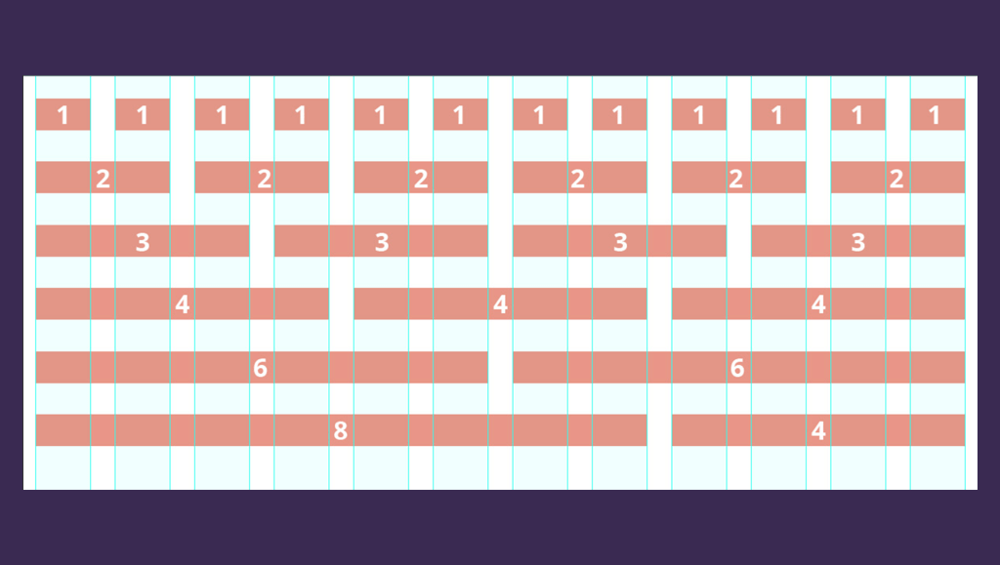

<br>

# **JavaScript 3**
### CS571: Building User Interfaces


<br>

#### Cole Nelson & Yuhang Zhao

---

### Before Lecture

<div>

 - Clone [today's code](https://github.com/CS571-F23/week03-js3-example) to your machine.

</div>


---

# JavaScript 2 Recap

---

### Callback Functions

`then` and `catch` take a *callback function* as an argument.

**Definition:** A *callback function* (sometimes called a *function reference*) is passed into another function as an argument, which is then invoked inside the outer function to complete a routine or action.


<sub><sup>More on [callback functions](https://developer.mozilla.org/en-US/docs/Glossary/Callback_function)</sup></sub>

---


`processUserInput` takes a *callback function*.

```javascript
const name = prompt('Please enter your name.');
function processUserInput(callback) {
  alert("Incoming message!")
  callback(name);
}
function greeting1(name) {
  alert('Hello ' + name);
}
const greeting2 = (name) => {
  alert('Whats up ' + name);
}
processUserInput(greeting1);
processUserInput(greeting2);
processUserInput((name) => alert("Welcome " + name));
```

[StackBlitz](https://stackblitz.com/edit/js-cdyed7?file=index.js) | [PythonTutor](https://pythontutor.com/render.html#code=const%20name%20%3D%20%22Cole%22%3B%20//%20Could%20prompt%20for%20this%20instead!%0Afunction%20processUserInput%28callback%29%20%7B%0A%20%20console.log%28%22Incoming%20message!%22%29%0A%20%20callback%28name%29%3B%0A%7D%0Afunction%20greeting1%28name%29%20%7B%0A%20%20console.log%28'Hello%20'%20%2B%20name%29%3B%0A%7D%0Aconst%20greeting2%20%3D%20%28name%29%20%3D%3E%20%7B%0A%20%20console.log%28'Whats%20up%20'%20%2B%20name%29%3B%0A%7D%0AprocessUserInput%28greeting1%29%3B%0AprocessUserInput%28greeting2%29%3B%0AprocessUserInput%28%28name%29%20%3D%3E%20console.log%28%22Welcome%20%22%20%2B%20name%29%29%3B&cumulative=false&curInstr=0&heapPrimitives=nevernest&mode=display&origin=opt-frontend.js&py=js&rawInputLstJSON=%5B%5D&textReferences=false)

---

### `fetch()`

```javascript
fetch(url)
  .then((response) => response.json()) // implict return
  .then((data) => {
    // fetch has already parsed data from JSON to a JS object!
    // Do something with the data
  })
  .catch(error => console.error(error)) // Print errors
```

[Fetching Jokes](https://stackblitz.com/edit/js-7qag38?file=index.html,index.js)


---

### Declarative vs Imperative Programming

We typically prefer *declarative* programming over *imperative* programming.

---

### Declarative vs Imperative Programming

Declarative array functions include `forEach`, `map`, `slice`, `concat`, `filter`, `some`, `every`, and `reduce`.

###

Last time we learned about `forEach`,`filter`, and `map`. Today we'll learn about `slice`, `concat`, `some`, `every`, and `reduce`!

---

### Warmup Problem

Given the following array, narrow the elements down such that we only keep elements that are numbers.

```js
const things = ["dogs", 1.2, 0, false, {name: "Alice"}, -7]
```

Can you do this *imperatively*? Use `for (... of ...)`

Can you do this *declaratively*? Use `filter`

---

### Warmup Imperative Solution

```js
let newThings = [];
for(let thing of things) {
  if (typeof thing === 'number') {
    newThings.push(thing);
  }
}
```

<br><br>

[StackBlitz](https://stackblitz.com/edit/js-6p6any?file=index.js)

---

### Warmup Declarative Solution

Using a Named Function

```js
function isANumber(something) {
  return typeof something === 'number'
}

let newThings1 = things.filter(thing => isANumber(thing))
let newThings2 = things.filter(isANumber)
```

<br>

[StackBlitz](https://stackblitz.com/edit/js-6p6any?file=index.js)

---

### Warmup Declarative Solution

Using an Anonymous Function

```js
// Explicit Return
let newThings3 = things.filter((thing) => {
 return typeof thing === 'number'
})

// Implicit Return
let newThings4 = things.filter((thing) => typeof thing === 'number')
```

<br>

[StackBlitz](https://stackblitz.com/edit/js-6p6any?file=index.js)

---

### Which is best?


Are you going to re-use the same logic?

 ➜ Use named function

Is it one and done?

 ➜ Use anon function

###

<sub><sup>Image from Willy Wonka (1971)</sup></sub>

---

### What will we learn today?

<div>

 - How to use other declarative functions?
 - How to use spreading and null coalescing?
 - How to perform data copying?
 - How to work with CSS libraries?

</div>

---

### `slice(begI, endI)` and `concat(arr)`

`slice` returns a shallow copy with an optional beginning (inclusive) and ending (exclusive) index.

```javascript
["apple", "banana", "coconut", "dragonfruit"].slice(1, 3); // ["banana", "coconut"]
```

`concat` joins two arrays together.

```javascript
["apple"].concat(["banana", "coconut"]); // ["apple", "banana", "coconut"]
```

---

### `some(cb)` and `every(cb)`

`some(cb)` returns `true` if the callback returns true for *some* element of the array, `false` otherwise.

```javascript
["sam", "jacob", "jess"].some(p => p === "jess"); // true!
```

`every(cb)` returns `true` if the callback returns true for *every* element of the array, `false` otherwise.

```javascript
["sam", "jacob", "jess"].every(p => p === "jess"); // false!
```

---

### Your turn!

Fetch data from our API and do "interesting" things!

`https://cs571.org/api/f23/weekly/week03`

 1. Can you get this data in Postman? How about using JavaScript?
 2. What were the names of the first 3 presidents?
 3. Was there *some* president named Thomas?
 4. Were *all* the presidents born in the 18th century?

---

### `reduce(cb, start)`

`reduce` takes a 2-parameter callback (previous and current values) and a starting value.

```javascript
[2, 4, -1.1, 7.2].reduce((prev, curr) => prev + curr, 1.2); // 13.3
```

<br>

[PythonTutor](https://pythontutor.com/render.html#code=const%20nums%20%3D%20%5B2,%204,%20-1.1,%207.2%5D%0Aconst%20sumOfNums%20%3D%20nums.reduce%28%28prev,%20curr%29%20%3D%3E%20prev%20%2B%20curr,%201.2%29%3B%0Aconsole.log%28sumOfNums%29&cumulative=false&curInstr=11&heapPrimitives=nevernest&mode=display&origin=opt-frontend.js&py=js&rawInputLstJSON=%5B%5D&textReferences=false)

---

### Building Objects with `reduce`

```javascript
const fruits = ['apple', 'banana', 'apple', 'orange', 'banana', 'apple'];
const countObj = fruits.reduce((acc, curr) => {
  acc[curr] = (acc[curr] || 0) + 1;
  return acc;
}, {});
console.log(countObj); // Output: { apple: 3, banana: 2, orange: 1 }
```

[PythonTutor](https://pythontutor.com/render.html#code=const%20fruits%20%3D%20%5B'apple',%20'banana',%20'apple',%20'orange',%20'banana',%20'apple'%5D%3B%0Aconst%20countObj%20%3D%20fruits.reduce%28%28acc,%20curr%29%20%3D%3E%20%7B%0A%20%20acc%5Bcurr%5D%20%3D%20%28acc%5Bcurr%5D%20%7C%7C%200%29%20%2B%201%3B%0A%20%20return%20acc%3B%0A%7D,%20%7B%7D%29%3B%0Aconsole.log%28countObj%29%3B%20//%20Output%3A%20%7B%20apple%3A%203,%20banana%3A%202,%20orange%3A%201%20%7D&cumulative=false&curInstr=0&heapPrimitives=nevernest&mode=display&origin=opt-frontend.js&py=js&rawInputLstJSON=%5B%5D&textReferences=false)

---

### `...` Spread Operator

We can spread arrays...

```javascript
const cats = ["apricat", "barnaby", "bucky", "colby"];

const newCats = [...cats, "darcy"];
```

---

### `...` Spread Operator


```javascript
const defs = {
  erf: "a plot of land",
  popple: "turbulent seas"
}

const newDefs = {
  ...defs,
  futz: "waste of time"
}
```

... and also objects! These are both *shallow* copies.

---

### Building Objects with `reduce` and `...`

```javascript
const fruits = ['apple', 'banana', 'apple', 'orange', 'banana', 'apple'];
const countObj = fruits.reduce((acc, curr) => {
  return {
    ...acc,
    [curr]: (acc[curr] || 0) + 1
 // ^^^^^^ is replaced with apple, banana, or orange
  }
}, {});
console.log(countObj); // Output: { apple: 3, banana: 2, orange: 1 }
```

---

### `??` Null Coalescing Operator

If left-hand is `null` or `undefined`, use right-hand.

```javascript
const IS_ENABLED = env.IS_ENABLED ?? true;

const USERNAME = document.getElementById("username").value ?? "";
```

How does this compare to ternary?

```javascript
const IS_ENABLED = env.IS_ENABLED ? env.IS_ENABLED : true; // always true!
```

[Try it on MDN](https://developer.mozilla.org/en-US/docs/Web/JavaScript/Reference/Operators/Nullish_coalescing)

---

### Note: JavaScript changes quickly!

Both `...` (ES6/ES2015) and `??` (ES2020) are not yet supported by PythonTutor!

---

### Your turn!

Using the same presidential data...

 1. How many terms were served in total?
 2. What are the unique political parties?
 3. Construct an object mapping president name to political affiliation.

---

# Data Copying

---

### Why would we need to copy?

 - We ❤️ using spread operator (see React!).
 - Copying a template object.
 - Passing an object to function where we don't want the object to be modified.
 - Data safety.

---

### Data Copying
`json.parse` and `json.stringify` can be useful for deep data copying.

```js
let dog = ... // some complex data we wish to preserve
let newDog = JSON.parse(JSON.stringify(dog));

newDog.age = 2                // does not change dog's age!
newDog.name.first = "Thomas"; // does not change dog's name!
```

<sup><sub>[When is deep copying with JSON.parse and JSON.stringify an issue?](https://lodash.com/)</sub></sup>


<sub><sup>[lodash is the preferred way to copy](https://stackblitz.com/edit/js-yqe3zb?file=index.js)</sup></sub>

---

### Data Copying

Sometimes we wish to make copies of data, e.g. we want to duplicate an array of student objects.

<div>

1. Reference Copy
2. Shallow Copy
3. Deep Copy

</div>

######

**Recall:** Variables are containers -- they contain a primitive value or a *pointer* to an object.

---

### Reference Copy

What will the output be?

```javascript
let myBasket = {
  basketId: 154,
  items: ["Apples", "Bananas", "Grapes"]
};
let myRefCopyBasket = myBasket; // *
myRefCopyBasket.basketId = 999;
myRefCopyBasket.items.push("Zucchinis");

console.log(myBasket);
console.log(myRefCopyBasket);
```

[Interactive Exercise](https://pythontutor.com/visualize.html#code=let%20myBasket%20%3D%20%7B%0A%20%20basketId%3A%20154,%0A%20%20items%3A%20%5B%22Apples%22,%20%22Bananas%22,%20%22Grapes%22%5D%0A%7D%3B%0Alet%20myRefCopyBasket%20%3D%20myBasket%3B%20//%20*%0AmyRefCopyBasket.basketId%20%3D%20999%3B%0AmyRefCopyBasket.items.push%28%22Zucchinis%22%29%3B%0A%0Aconsole.log%28myBasket%29%3B%0Aconsole.log%28myRefCopyBasket%29%3B&cumulative=false&curInstr=0&heapPrimitives=nevernest&mode=display&origin=opt-frontend.js&py=js&rawInputLstJSON=%5B%5D&textReferences=false)

---

### Reference Copy

```javascript
let myBasket = {
  basketId: 154,
  items: ["Apples", "Bananas", "Grapes"]
};
let myRefCopyBasket = myBasket; // *
myRefCopyBasket.basketId = 999;
myRefCopyBasket.items.push("Zucchinis");

console.log(myBasket);
console.log(myRefCopyBasket);
```

```
{basketId: 999, items: ['Apples', 'Bananas', 'Grapes', 'Zucchinis']}
{basketId: 999, items: ['Apples', 'Bananas', 'Grapes', 'Zucchinis']}
```

---

### Shallow Copy

What will the output be?

```javascript
let myBasket = {
  basketId: 154,
  items: ["Apples", "Bananas", "Grapes"]
};
let myShallowCopyBasket = {...myBasket}; // *
myShallowCopyBasket.basketId = 999;
myShallowCopyBasket.items.push("Zucchinis");

console.log(myBasket);
console.log(myShallowCopyBasket);
```

[Interactive Exercise](https://pythontutor.com/visualize.html#code=let%20myBasket%20%3D%20%7B%0A%20%20basketId%3A%20154,%0A%20%20items%3A%20%5B%22Apples%22,%20%22Bananas%22,%20%22Grapes%22%5D%0A%7D%3B%0Alet%20myShallowCopyBasket%20%3D%20Object.assign%28%7B%7D,%20myBasket%29%3B%20//%20%7B...%7D%20is%20ES2018%20syntax%0AmyShallowCopyBasket.basketId%20%3D%20999%3B%0AmyShallowCopyBasket.items.push%28%22Zucchinis%22%29%3B%0A%0Aconsole.log%28myBasket%29%3B%0Aconsole.log%28myShallowCopyBasket%29%3B&cumulative=false&curInstr=0&heapPrimitives=nevernest&mode=display&origin=opt-frontend.js&py=js&rawInputLstJSON=%5B%5D&textReferences=false)

---

### Shallow Copy

```javascript
let myBasket = {
  basketId: 154,
  items: ["Apples", "Bananas", "Grapes"]
};
let myShallowCopyBasket = {...myBasket}; // *
myShallowCopyBasket.basketId = 999;
myShallowCopyBasket.items.push("Zucchinis");

console.log(myShallowCopyBasket);
console.log(myRefCopyBasket);
```

```
{basketId: 154, items: ['Apples', 'Bananas', 'Grapes', 'Zucchinis']}
{basketId: 999, items: ['Apples', 'Bananas', 'Grapes', 'Zucchinis']}
```

---

### Deep Copy

What will the output be?

```javascript
let myBasket = {
  basketId: 154,
  items: ["Apples", "Bananas", "Grapes"]
};
let myDeepCopyBasket = JSON.parse(JSON.stringify(myBasket)); // *
myDeepCopyBasket.basketId = 999;
myDeepCopyBasket.items.push("Zucchinis");

console.log(myBasket);
console.log(myDeepCopyBasket);
```

[Interactive Exercise](https://pythontutor.com/visualize.html#code=let%20myBasket%20%3D%20%7B%0A%20%20basketId%3A%20154,%0A%20%20items%3A%20%5B%22Apples%22,%20%22Bananas%22,%20%22Grapes%22%5D%0A%7D%3B%0Alet%20myDeepCopyBasket%20%3D%20JSON.parse%28JSON.stringify%28myBasket%29%29%3B%20//%20*%0AmyDeepCopyBasket.basketId%20%3D%20999%3B%0AmyDeepCopyBasket.items.push%28%22Zucchinis%22%29%3B%0A%0Aconsole.log%28myBasket%29%3B%0Aconsole.log%28myDeepCopyBasket%29%3B&cumulative=false&curInstr=0&heapPrimitives=nevernest&mode=display&origin=opt-frontend.js&py=js&rawInputLstJSON=%5B%5D&textReferences=false)

---

### Deep Copy

```javascript
let myBasket = {
  basketId: 154,
  items: ["Apples", "Bananas", "Grapes"]
};
let myDeepCopyBasket = JSON.parse(JSON.stringify(myBasket)); // *
myDeepCopyBasket.basketId = 999;
myDeepCopyBasket.items.push("Zucchinis");

console.log(myBasket);
console.log(myDeepCopyBasket);
```

```
{basketId: 154, items: ['Apples', 'Bananas', 'Grapes']}
{basketId: 999, items: ['Apples', 'Bananas', 'Grapes', 'Zucchinis']}
```


---

# Working with CSS Libraries

---

### What are CSS Libraries?

**Definition:** Software libraries that abstract away the low-level CSS implementation of user-facing elements.

Some popular libraries include...
<div>

* [Bootstrap](https://getbootstrap.com/)
* [Foundation](https://foundation.zurb.com/)
* [Semantic UI](https://semantic-ui.com/)
* [Pure](https://purecss.io/)
* [UIkit](https://getuikit.com/v2/)

</div>

---

## Bootstrap


[getbootstrap.com](https://getbootstrap.com/)


---

## Why does the web look alike?

Many, many, many (new) websites use Bootstrap!

<div>

[OHWL]()
[Partner Finder](https://partner-finder-72c59d07186d.herokuapp.com/login)
[CS571](https://www.cs571.org/)

</div>

**Bootstrap:** get (oneself or something) into or out of a situation using existing resources.

<sub><sup>Oxford Dictionary</sup></sub>

---

## How Bootstrap Works

Bootstrap provides us with...

<div>

* Layouts
* Content
* Components
* Utilities

</div>

###

There is much more!

---

### Bootstrap Categories: **Layouts**

<div>

**Containers** are the most basic element of layouts.


```html
<div class="container">
  ...
</div>
```

```html
<div class="container-fluid">
  ...
</div>
```

</div>

---

### Grids

Often, containers will contain **rows** and **columns** to form a grid...

```html
<div class="container">
  <div class="row">
    <div class="col-*"></div>
    <div class="col-*"></div>
  </div>
</div>
```

Where `*` is the *column span*.

[StackBlitz](https://stackblitz.com/edit/js-2wv34r?file=index.html)

---



### Grid System

<br/>
<br/>
<br/>
<br/>
<br/>
<br/>
<br/>
<br/>

<sub><sup>[Medium](https://medium.com/@mobomo/replicate-bootstrap-3-grid-using-css-grid-624c1088b0bc)</sup></sub>


---

#### Responsive Design

**Definition:** Responsive design adapts content to a variety of devices and screen sizes.

Width breakpoints determine whether the design will scale or be reorganized.


<sub><sup>[InVision](https://s3.amazonaws.com/www-assets.invisionapp.com/uploads/2018/10/INV_Responsive_Image_One_L1R1.png)</sup></sub>

---

### Responsive Design

What if we want our webpage to respond to different screen sizes, e.g. phone, tablet, and monitor?

```html
<div class="container">
  <div class="row">
    <div class="col-12 col-md-6 col-lg-3"></div>
    <div class="col-12 col-md-6 col-lg-3"></div>
    <div class="col-12 col-md-6 col-lg-3"></div>
    <div class="col-12 col-md-6 col-lg-3"></div>
  </div>
</div>
```

<sub><sup>[Responsive Design Example](https://stackblitz.com/edit/js-4psx3h?file=index.html)</sup></sub>

---


---

### Bootstrap Categories: **Content**

Content styling includes basic HTML elements, typography, code, images, tables, figures.

Basic HTML examples:

```html
<h1></h1>
<ul></ul>
<input/>
<button></button>
```

These will get the default Bootstrap styling.

---

### Styling of other elements

```html

```

```html
<table class="table">
  <thead class="thead-dark">
    <tr>
      <th scope="col">...</th>
      ...
```

```html
<div class="table-responsive-sm">
  <table class="table">
  ...
```

---

### Bootstrap Categories: **Components**

Components include all other visual/interactive elements that make up the design, e.g., buttons, forms, navbar, tooltips, etc. 

```html
<button type="button" class="btn btn-primary">Fill button</button>

<button type="button" class="btn btn-outline-primary">Outline button</button>

<div class="btn-group-toggle" data-toggle="buttons">
  <label class="btn btn-secondary active">
    <input type="checkbox" checked autocomplete="off"> Switch
  </label>
</div>
```

---

### Bootstrap Categories: **Utilities**

Utilities are not elements themselves, but they modify/control other elements, e.g., adding rounded corners to an image.

```html

```

```html
<div class="shadow p-3 mb-5 bg-white rounded">Shadow</div>
```

---

# Example Home Page
[See in CodePen](https://codepen.io/yuhangz/pen/jOwazjv?editors=1111)

Also, see [cs571.org](https://cs571.org/) for responsive design.

---

### Additional Resources

<div>

* [Bootstrap Documentation](https://getbootstrap.com/docs/4.3/getting-started/introduction/)
* [Tutorial Republic](https://www.tutorialrepublic.com/twitter-bootstrap-tutorial/)
* [W3 Schools](https://www.w3schools.com/bootstrap/default.asp)

</div>

---

### Assets
Asset libraries, e.g., icons, are usually used in conjunction with frameworks such as Bootstrap.


See [icon libraries](https://getbootstrap.com/docs/4.3/extend/icons/).

<sub><sup>[Image Source](https://fontawesome.com/)</sup></sub>

---

# Questions?