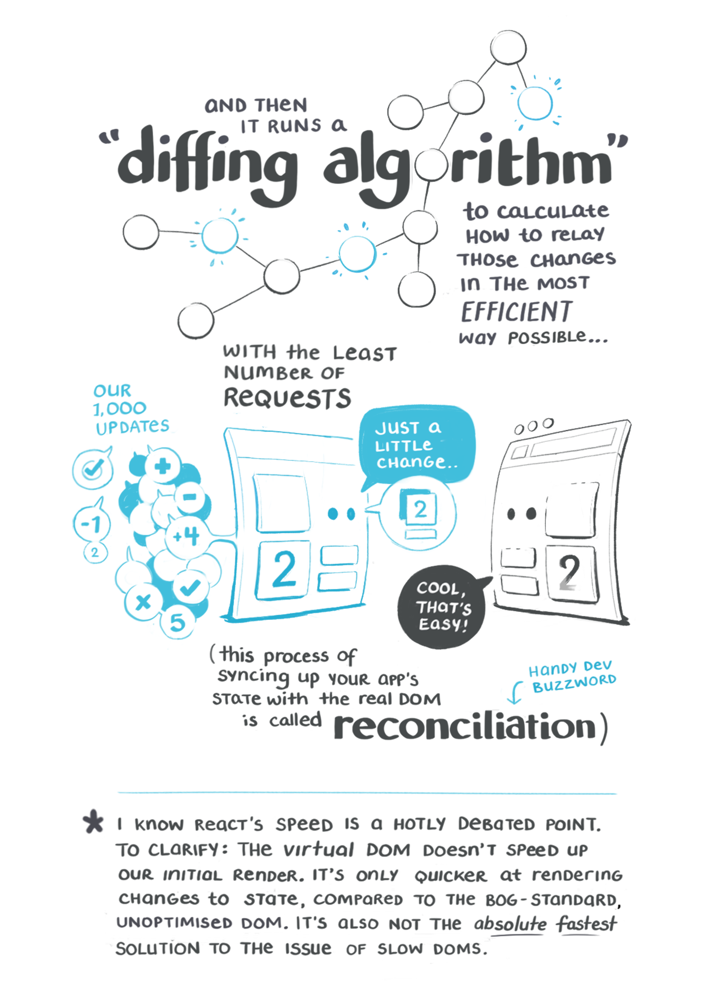
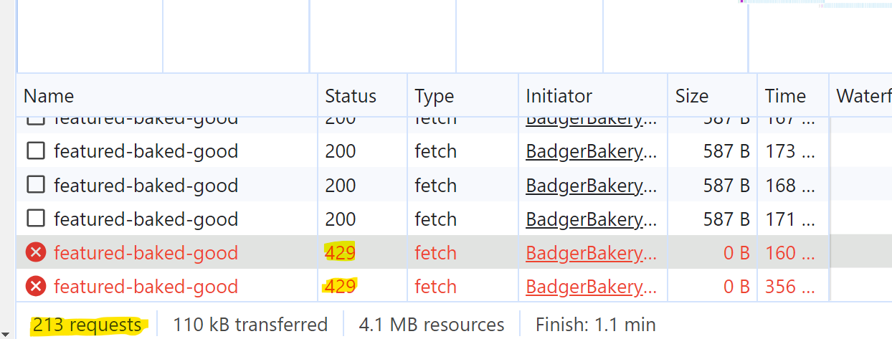

<br>

# **React 1**
### CS571: Building User Interfaces


<br>

#### Cole Nelson & Yuhang Zhao

---

### Before Lecture

<div>

 - Download and install [NPM 9 and Node 18](https://nodejs.org/en/download)
 - Clone [today's code](https://github.com/CS571-F23/week04-r1-example) to your machine.
    - Run the command `npm install` inside of the `starter` folder.

</div>

---

### Disclaimer
As with JS, this is not a comprehensive introduction to React, so be sure to check out the [React Docs](https://react.dev/reference/react).

Avoid [legacy.reactjs.org](https://legacy.reactjs.org/)


---

### What will we learn today?

<div>

- History and overview of React
- Setting up a React project
- Building a basic React project
- `useState` and `useEffect` hooks
- Using other components
- Common issues

</div>

---

### What is React?

**Definition:** Also called ReactJS, React is a JS library for building user interfaces.

* Developed by Facebook, dating back to 2010.
* Started as an internal development tool, then open-sourced in 2013.

[More on the history of React](https://blog.risingstack.com/the-history-of-react-js-on-a-timeline/)

---

### Why should we use React?

Among many reasons...

<div>

 - `innerHTML` is bad!
 - Efficient DOM updating
 - Declarative programming

</div>

---

# `innerHTML` is bad!

---

### Review: `innerHTML`

```html
<html>
  <head></head>
  <body>
    <h1>Badger Book</h1>
    <div id="student"></div>
  </body>
</html>
```

```js
const name = "Cole"; // get data from api
document.getElementById("student").innerHTML = '<h2>' + name + '</h2>'
```

---

### XSS

Cross-Site Scripting (XSS) attacks are a type of injection, in which malicious scripts are injected into otherwise benign and trusted websites.

**Remember:** You supplied the data in HW0!

<sub><sup>[OWASP Definition](https://owasp.org/www-community/attacks/xss/)</sup></sub>

---

### Badger Book XSS

```html
<html>
  <head></head>
  <body>
    <h1>Badger Book</h1>
    <div id="student"></div>
  </body>
</html>
```

```js
const name = "<image src='abc.png' onerror='alert(document.cookie)'/>";
document.getElementById("student").innerHTML = '<h2>' + name + '</h2>'
```

Try it! `https://cs571.org/api/f23/hw2/students-xss`

---

# Efficient DOM Updating

---

### Refresher

**Definition:** Document Object Model (DOM) translates an HTML document into a tree structure where each node represents an object on the page.

<sub><sup>[Wikipedia: DOM](https://en.wikipedia.org/wiki/Document_Object_Model)</sup></sub>


---

For JS to interact with user-facing elements, we use to access them via the `document`, e.g. `document.getElementById`.

But in React...

```javascript
for (let i = 0; i < 10; i++) {
  console.log('I will no longer use document to access DOM elements.');
  console.log('I will no longer use document to manipulate DOM elements.');
  console.log('I will let React handle the DOM for me.');
}
```

---

## What's so bad about the DOM?
Interactively directly with it can be slow!

  - *Single-page applications (SPAs)* can be huge.
  - Interactive applications require a large number of and frequent updates on DOM elements.


<sub><sup>[Image Source](https://tenor.com/search/instagram-gifs)</sup></sub>

---

### Solution: The *Virtual DOM*

**Definition:** The virtual DOM is a *virtual* representation of the user-facing elements that are kept in memory and synced with the real DOM when DOM elements are updated.


<sub><sup>[Image Source](https://blog.csdn.net/gongch0604/article/details/86630260)</sup></sub>

---

### Virtual DOM: *Reconciliation*

**Definition:** *Reconciliation* is the process of *diffing* and syncing the virtual and real DOM to render changes for the user.


<sub><sup>[Image Source](https://almerosteyn.com/2017/11/id24-accessible-react-tips-tools-tricks#/22)</sup></sub>

---


<br><br><br><br><br><br><br><br><br><br>

<sub><sup>[Image Source](https://i0.wp.com/programmingwithmosh.com/wp-content/uploads/2018/11/lnrn_0201.png?ssl=1)</sup></sub>

---

### What are the benefits of a Virtual DOM?
- Incredibly fast, as only what is updated in the Virtual DOM is updated in the real DOM.
- Abstracts away interactions with DOM; makes programming more *declarative*.
- Used in React and vue.js; Angular does its own thing.

---

# The ReactDOM

Credit: [Maggie Appleton](https://maggieappleton.com/)


---


---




---

# Declarative Programming
Every component is a function!

---

# React
by Meta

###

### 👍❤️😆😮😢😠


---

<div class="center-info">


[React in 100 Seconds](https://www.youtube.com/watch?v=Tn6-PIqc4UM)

</div>

---

### Getting Started

What you will need: *terminal*, *IDE*, *NPM*, and *Node.js*

```bash
npm create vite@latest my-app-name -- --template react
cd my-app-name
npm install
npm run dev
```

For the HWs, these steps will already be done for you.

---

### Getting Started

For an existing React project, you simply need to...

```bash
npm install
npm run dev
```

[Clone, install, and start the starter code.](https://github.com/CS571-F23/week04-react1-inclass-example.git) You can install and start the completed code later.

This has [react-bootstrap](https://react-bootstrap.github.io/) installed.

---

### What did I just run?

`npm install` downloads the `dependencies` from your `package.json` to `node_modules`

###

`npm run dev` starts a local webserver. We don't open `index.html` anymore -- we go to `localhost:5173`

---

### React Essentials

Every "thing" is a component.

Every component is a function, inheriting `props` and maintaining an internal `state`.

A component will re-render when...

<div>

 1. its `props` changes
 2. its `state` changes
 3. its parent re-renders

</div>

---

### What defines a component?

<div>

 - Similar question: *what defines a class in Java?*
 - Some re-usable piece of the interface.
 - May have many children, but only one parent.

 </div>

###

#### Identify components in the next slide..

---


---

### Example of a React Component

This React component displays Hello World on the webpage using JSX.

The `return` is what is displayed for a component.

```javascript
function Welcome() {
  return <h1>Hello World!</h1>;
}
```

[ESBuild](https://esbuild.github.io/) transpiles JSX into HTML, CSS, and JS.

[StackBlitz](https://stackblitz.com/edit/react-vokc3e)

---


### Note: Class vs Functional Components

A class component looks like this...

```javascript
class Welcome extends React.Component {
  render() {
    return <h1>Hello World!</h1>;
  }
}
```

Functional components were introduced in React 16.8. They are the most commonly used in new React code. We will not cover class components in this course.

---

### React Components

React components can have props given by its parent...

```javascript
function App() {
  return (
    <div>
      <Welcome person="Charlie"></Welcome>
      <Welcome person="Jessica"></Welcome>
      <Welcome person="Tonya"></Welcome>
    </div>
  );
}
function Welcome(props) {
  return <h1>Welcome, {props.person}</h1>;
}
```

[StackBlitz](https://stackblitz.com/edit/react-6i82yg)

---

### React Components
...or can maintain an internal state.

```javascript
function Welcome() {
  const [name, setName] = useState("Alba");
  return <h1>Welcome, {name}</h1>;
}
```

[StackBlitz](https://stackblitz.com/edit/react-b2yntn)

---

### React Components
... or have both!

```javascript
function App() {
  return <Welcome message="Good evening, "></Welcome>
}

function Welcome(props) {
  const [name, setName] = useState("Rodriguez");
  return <h1>{props.message} {name}</h1>;
}
```

[StackBlitz](https://stackblitz.com/edit/react-bunygm)

---

### JSX Basics

Curly braces `{}` interpolate a JS expression.

```html
<div>
  <h2>{name}</h2>
  <a href={url} target="_blank">My Website</a>
  {
    classes.map(clazz => 
      <div key={clazz.name}>
        <p>{clazz.name} is worth {clazz.creds} credits</p>
      </div>
    )
  }
</div>
```

[StackBlitz](https://stackblitz.com/edit/stackblitz-starters-rp33o7?file=src%2FSchedule.jsx)


---

### React Hooks
Hooks are small React features. Today, we will cover...

<div>

 - `useState`
 - `useEffect`

 </div>

---

### `useState` Hook

Used to maintain state! Takes an initial value as an argument. Returns a pair of the *read-only* state value and a *mutator* function.

*Always* use the mutator function to modify state.

*Never* modify the state directly.

```javascript
const [name, setName] = useState("James");
```

---

### `useState` Hook

```javascript
const [name, setName] = useState("James");
```

We can use `name` to *read* the name and `setName` to *change* the name...

```javascript
console.log(name);
setName("Jim");
console.log(name); // still James???
```

`setName` happens *asynchronously*. See `useEffect`.

[StackBlitz](https://stackblitz.com/edit/react-nscfek?file=src/App.js)

---

### `useEffect` Hook
Used to perform an action on component load or state change. Takes a callback function and an array of state dependencies as arguments.

```javascript
useEffect(() => {
  alert("The page has been reloaded!");
}, [])
```

```javascript
useEffect(() => {
  alert("You changed your name to " + name);
}, [name])
```


---

### `useState` Hook

```javascript
const [name, setName] = useState("James");
```

The mutator can be called like...

```javascript
setName("Jim");
```

... or with a callback function of the previous value.

```javascript
setName(oldName => oldName.substring(0, oldName.length - 1));
```

---

### `useState` Hook

Why is this useful? Arrays!

```javascript
const [names, setNames] = useState(["James", "Jess"]);
```

Remember we cannot *mutate* the state variable.

```javascript
setNames((oldNames) => [...oldNames, "Jim"]);
```

We cannot (rather, should not) do `push`.

---

### Why?

When does React re-render a component? When...

<div>

 1. its `props` changes
 2. its `state` changes
 3. its parent re-renders

</div>

---

### So...

Good Example
```js
const [name, setName] = useState("James");
// ...
setName("Jim"); // Good! React will pick up on this change and re-render soon.
```

Bad Example
```js
let name = "James";
// ...
name = "Jim"; // Bad! React won't pick up on this.
```

---

### Imports and Exports

Functions must be exported to be used in other files, e.g. `export default FindMyBadgers`.

###

This can then be imported, e.g. `import FindMyBadgers from "./components/FindMyBadgers"`

---

### Imports and Exports

Functions can export one object as default, other exports can be non-default, e.g. `export HelperFunc2`.

###

These can then be imported, e.g.
`import { HelperFunc2 } from "./utils/HelperFuncs"`

---

### Imports and Exports

Imports from 3rd party libraries do *not* use relative pathing, e.g.

`import React, { useState } from 'react'`

`import { Container } from 'react-bootstrap'`

Getting a 'not defined' error? Check your imports!

---

# Let's make a React App!
Find my Badgers using [randomuser.me](https://randomuser.me/)

[StackBlitz Solution](https://stackblitz.com/edit/react-gjnfht)

Also [see the solution](https://github.com/CS571-F23/week04-r1-example/tree/main/solution) from today's example!

---

# Common HW Issues

---

### Blank Screen

Use your Developer Tools! (F12)

Check both the "Console" and "Network" tabs.

---

### HTTP 401

Unauthorized...

Are you logged in?


---

### HTTP 429

Too many requests...

```js
useEffect(() => {
  // your code here!
}, []) // <--- don't forget me!
```
... did you forget the empty dep. array?



---

### X is not defined

Did you import it? e.g.

<sub>Common React Imports</sub>

```js
import { useState, useEffect } from "react";
```

<sub>Common Bootstrap Imports</sub>

```js
import { Button, Card } from "react-bootstrap";
```


---

### Empty State

Setting state is asynchronous!

```javascript
const [name, setName] = useState("James");
console.log(name);
setName("Jim");
console.log(name); // still James!
```

Use `useEffect` to listen for changes.

```js
useEffect(() => {
  console.log("Your new name is... " + name)
}, [name])
```

---

### What did we learn today?

<div>

- History and overview of React
- Setting up a React project
- Building a basic React project
- `useState` and `useEffect` hooks
- Using other components
- Common issues

</div>

---

# Questions?
