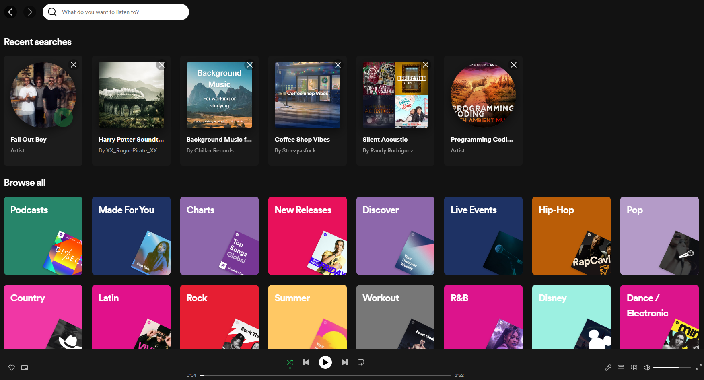
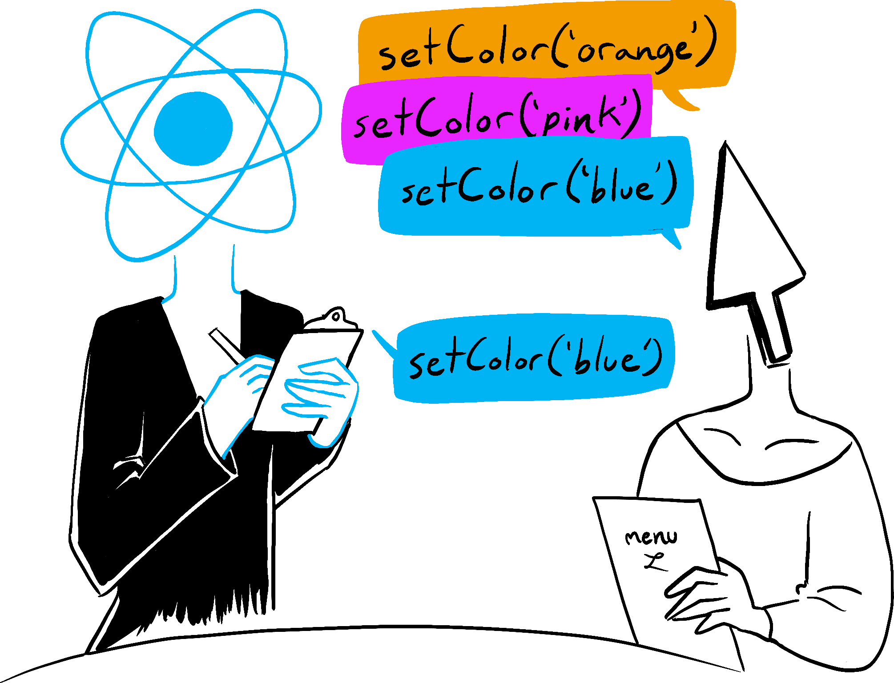
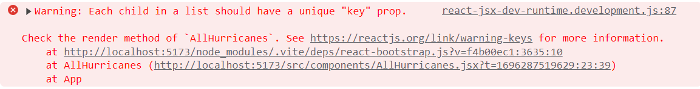

<br>

# **React 2**
### CS571: Building User Interfaces


<br>

#### Cole Nelson & Yuhang Zhao


---

### Before Lecture

<div>

 - Clone [today's code](https://github.com/CS571-F23/week05-r2-example) to your machine.
    - Run the command `npm install` inside of the `starter` and `solution` folders.

</div>

---

# React Recap

---

### React Essentials

Every "thing" is a component.

Every component is a function, inheriting `props` and maintaining an internal `state`.

### What defines a component?

<div>

 - Similar question: *what defines a class in Java?*
 - Some re-usable piece of the interface.
 - May have many children, but only one parent.

 </div>

---



---

### Example of a React Component

This React component displays Hello World on the webpage using JSX.

```javascript
function Welcome() {
  return <h1>Hello World!</h1>;
}
```

[ESBuild](https://esbuild.github.io/) transpiles JSX into HTML, CSS, and JS.

[StackBlitz](https://stackblitz.com/edit/react-vokc3e)

---

### Two Hooks

`useState` store some state.

```js
const [name, setName] = useState('Charles')
```

`useEffect` conditionally run logic, e.g. fetch on component load, alert on name change

```js
useEffect(() => {
  alert("Your name has been changed!")
}, [name])
```

---

### What will we learn today?

<div>

 - How do we work with arrays of data in React? 
   - How do we `map` out components?
   - How does the `key` property work?
 - How do we do responsive design in React?
 - How can we break up large sums of data using pagination?
 - How can we use controlled `input` components?
</div>

---

# Brain Teaser
Two ways to set the state...

`setNum(4)` - overwriting the value

`setNum(n => n + 1)` - update the existing value

---

### Why do we use this syntax?

[BAD Example](https://react.dev/learn/queueing-a-series-of-state-updates#react-batches-state-updates)

```js
export default function Counter() {
  const [number, setNumber] = useState(0);
  return <div>
    <h1>{number}</h1>
    <button onClick={() => {
      setNumber(number + 1);
      setNumber(number + 1);
      setNumber(number + 1);
    }}>+3</button>
  </div>
}
```

---

### Why do we use this syntax?

[Good Example](https://react.dev/learn/queueing-a-series-of-state-updates#updating-the-same-state-multiple-times-before-the-next-render)

```js
export default function Counter() {
  const [number, setNumber] = useState(0);
  return <div>
    <h1>{number}</h1>
    <button onClick={() => {
      setNumber(n => n + 1);
      setNumber(n => n + 1);
      setNumber(n => n + 1);
    }}>+3</button>
  </div>
}
```

---



<br/>
<br/>
<br/>
<br/>
<br/>
<br/>
<br/>
<br/>
<br/>
<br/>
<br/>

<sub><sup>Illustration by [Rachel Lee Nabors](http://rachelnabors.com/)</sup></sub>

---

# Your turn!

Use Postman to explore the hurricane data from...

```
https://cs571.org/api/f23/weekly/week05
```

... how will we add this to a state variable?

---

### Fetching Data

**NEVER** assign/push directly to a state variable...

```js
function AllHurricanes() {
  const [hurricanes, setHurricanes] = useState([]);
  useEffect(() => {
    fetch("https://cs571.org/api/f23/weekly/week05")
      .then(res => res.json())
      .then(data => {
        for (let hurr of data) {
          hurricanes.push(hurr) // !!! VERY BAD !!!
        }
      })
  }, [])
  // ...
}
```

---

### Fetching Data

When changing the array, use the callback syntax...

```js
function AllHurricanes() {
  const [hurricanes, setHurricanes] = useState([]);
  useEffect(() => {
    fetch("https://cs571.org/api/f23/weekly/week05")
      .then(res => res.json())
      .then(data => {
        for (let hurr of data) {
          setHurricanes([...hurricanes, hurr]) // !!! BAD !!!
        }
      })
  }, [])
  // ...
}
```

---

### Fetching Data

... like this!

```js
function AllHurricanes() {
  const [hurricanes, setHurricanes] = useState([]);
  useEffect(() => {
    fetch("https://cs571.org/api/f23/weekly/week05")
      .then(res => res.json())
      .then(data => {
        for (let hurr of data) {
          setHurricanes(oldHurrs => [...oldHurrs, hurr]) // Better :)
        }
      })
  }, [])
  // ...
}
```

---

### Note on Hot Reloading

React (Vite) will keep your old state when hot reloading. The prior solution will result in duplicates upon saving your solution.

---

### Fetching Data

Best. **Why?** We are *overwriting* the value. No need to worry about duplicates.

```js
function AllHurricanes() {
  const [hurricanes, setHurricanes] = useState([]);
  useEffect(() => {
    fetch("https://cs571.org/api/f23/weekly/week05")
      .then(res => res.json())
      .then(data => {
        setHurricanes(data) // Good :)
      })
  }, [])
  // ...
}
```

---

# Your turn!
Do steps 0 and 1 of the starter code.

---

### Displaying Arrays of Data

**Goal:** Make *components* out of the *data*.

```js
function AllHurricanes() {
  // ...
  return <div>
    <h1>Hurricane Finder</h1>
    {/* TODO Show hurricane components here! */}
  </div>
}
```

---

### Displaying Arrays of Data

**Solution:** `map` each piece of data to JSX!

```js
function AllHurricanes() {
  // ...
  return <div>
    <h1>Hurricane Finder</h1>
    {
      hurricanes.map(hurr => <Hurricane></Hurricane>)
    }
  </div>
}
```

---

### Displaying Arrays of Data

You'll often see this written short-hand.

```js
function AllHurricanes() {
  // ...
  return <div>
    <h1>Hurricane Finder</h1>
    {
      hurricanes.map(hurr => <Hurricane/>)
    }
  </div>
}
```

---

### Displaying Arrays of Data w/  Props

Don't forget to pass each hurricane its `props`!

```js
function AllHurricanes() {
  // ...
  return <div>
    <h1>Hurricane Finder</h1>
    {
      hurricanes.map(hurr => <Hurricane
        name={hurr.name}
        category={hurr.category}
        start_date={hurr.start_date}
      />)
    }
  </div>
}
```

---

### Displaying Arrays of Data w/  Props

You'll often see this written short-hand.

```js
function AllHurricanes() {
  // ...
  return <div>
    <h1>Hurricane Finder</h1>
    {
      hurricanes.map(hurr => <Hurricane {...hurr}/>)
    }
  </div>
}
```

---

### Uh oh!

Check your console!

<br/><br/><br/><br/><br/><br/>

Each component needs a unique `key`.



---

### React `key` Prop

The `key` prop is used by React to speed up rendering. 
 - Always use a *unique* key for the *parent-most* element rendered in a list.
 - This key needs to be *unique among siblings*.
 - This key should *usually* not be the index of the item (e.g. what if the order changes?)

[Learn More](https://react.dev/learn/rendering-lists#why-does-react-need-keys)

---

### Displaying Arrays of Data

Must specify a key! Not accessible via `props.key`.

```js
function AllHurricanes() {
  // ...
  return <div>
    <h1>Hurricane Finder</h1>
    {
      hurricanes.map(hurr => <Hurricane key={hurr.id} {...hurr}/>)
    }
  </div>
}
```

---

# Your turn!
Do steps 2 and 3 of the starter code.


---

### Responsive Design

We use [react-bootstrap](https://react-bootstrap.netlify.app/).

See the [grid docs](https://react-bootstrap.netlify.app/docs/layout/grid).

###

Important takeaways...
<div>

 - Use `Container`, `Row`, and `Col` components.
- `xs`, `sm`, `md`, `lg`, `xl`, and `xxl` are props.

</div>

---

### Responsive Design

This is how we wrote Bootstrap in Vanilla JS...

```html
<div class="container">
  <div class="row">
    <div class="col-12 col-md-6 col-lg-3"></div>
    <div class="col-12 col-md-6 col-lg-3"></div>
    <div class="col-12 col-md-6 col-lg-3"></div>
    <div class="col-12 col-md-6 col-lg-3"></div>
  </div>
</div>
```

---

### Responsive Design

...this is how we will in React!

```jsx
<Container>
  <Row>
    <Col xs={12} md={6} lg={3}></Col>
    <Col xs={12} md={6} lg={3}></Col>
    <Col xs={12} md={6} lg={3}></Col>
    <Col xs={12} md={6} lg={3}></Col>
  </Row>
</Container>
```

[StackBlitz](https://stackblitz.com/edit/stackblitz-starters-e82vw5?file=src%2FApp.js)

---

# Your turn!
Do steps 4 and 5 of the starter code.

---

### Pagination

Also available in [react-bootstrap](https://react-bootstrap.netlify.app/docs/components/pagination).

Useful for handling large sums of data.

```jsx
{/* Display items here. */}

<Pagination>
  <Pagination.Item active={false}>1</Pagination.Item>
  <Pagination.Item active={false}>2</Pagination.Item>
  <Pagination.Item active={false}>3</Pagination.Item>
  <Pagination.Item active={false}>4</Pagination.Item>
</Pagination>
```

---

### Pagination

Use a state variable to track which page is active.

```jsx
function SomeBigData() {
  const [page, setPage] = useState(1)
  return <div>
    {/* Display some data here! */}
    <Pagination>
      <Pagination.Item active={page === 1} onClick={() => setPage(1)}>1</Pagination.Item>
      <Pagination.Item active={page === 2} onClick={() => setPage(2)}>2</Pagination.Item>
      <Pagination.Item active={page === 3} onClick={() => setPage(3)}>3</Pagination.Item>
      <Pagination.Item active={page === 4} onClick={() => setPage(4)}>4</Pagination.Item>
    </Pagination>
  </div>
}
```

[StackBlitz](https://stackblitz.com/edit/stackblitz-starters-dydwdf?file=src%2FApp.js)

---

### Pagination

When displaying the data, use `slice` to only show the items on the current page!

```jsx
function SomeBigData() {
  const [page, setPage] = useState(1)
  return <div>
    {
      bigData.slice((page - 1) * 16, page * 16).map(name => <p>{name}</p>)
    }
    {/* Display Pagination Items here! */}
  </div>
}
```

[StackBlitz](https://stackblitz.com/edit/stackblitz-starters-dydwdf?file=src%2FApp.js)

---

# Your turn!
Complete the hurricane example.

---

### Handling Text Input

We can get user input using the HTML `input` tag or the React-Bootstrap `Form.Control` component.

We can get user input...

 - in a *controlled* way using its `value` and tracking `onChange` events
 - in an *uncontrolled* manner using `useRef`.
   - we'll cover this next time!

---

### Controlled Components

We can *control* an input component via its `value` and `onChange` properties.

<br/>

[Example of a controlled input component](https://stackblitz.com/edit/react-q134ha)

[Example of a controlled input component (Bootstrap)](https://stackblitz.com/edit/react-pga7ma?file=src%2FApp.js)

---


### What did we learn today?

<div>

 - How do we work with arrays of data in React? 
   - How do we `map` out components?
   - How does the `key` property work?
 - How do we do responsive design in React?
 - How can we break up large sums of data using pagination?
 - How can we use controlled `input` components?
</div>


---

# Questions?