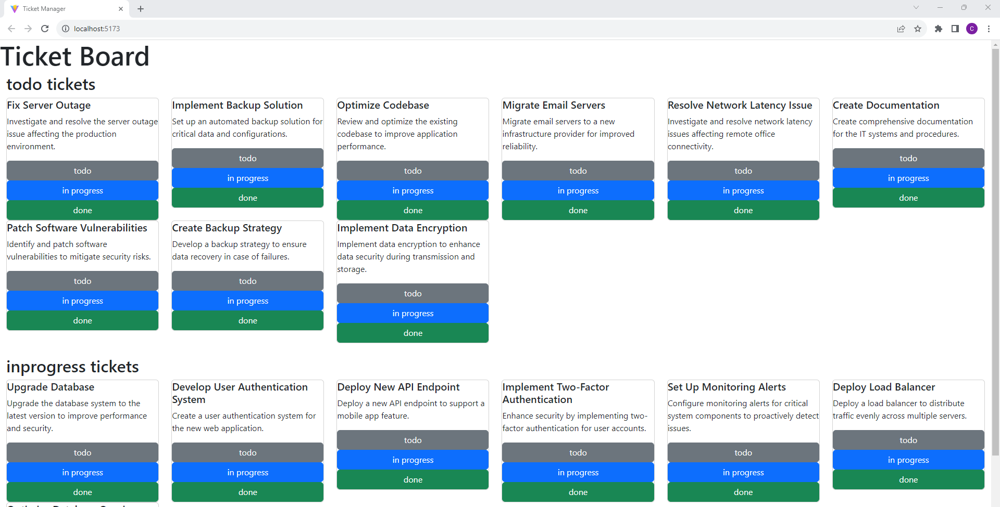
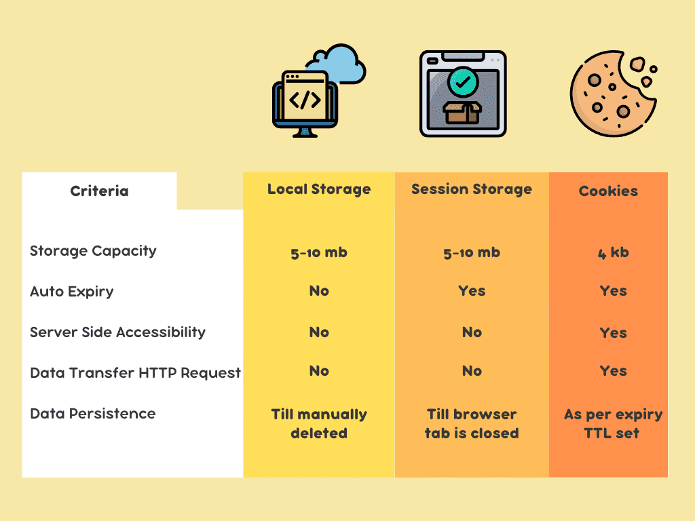

<br>

# **React 3**
### CS571: Building User Interfaces


<br>

#### Cole Nelson & Yuhang Zhao

---

### Before Lecture

<div>

 - Clone [today's code](https://github.com/CS571-F23/week06-r3-example) to your machine.
    - Run the command `npm install` inside of the `starter`, `mid-solution`, and `solution` folders.
 - Complete your daily [Wordle](https://www.nytimes.com/games/wordle/index.html).
   - We'll be going through it in class.

</div>

---

### Quick Notes...

1. Uncontrolled components moved to React 4.
2. Midterm exam is on Thursday, Oct 26th @ 5:45 pm.
  a. No class during the afternoon. 
  b. Old exams are on Canvas.
  c. You will have 1 hour for 30 MC problems.
  d. You may bring a **single-sided** notesheet.
  e. Conflict? [Let us know ASAP.](https://docs.google.com/forms/d/e/1FAIpQLSemwFFffIqYGMxh4TMaztOqVtqIbuD2KGstFJpdyEfdOmNrDQ/viewform)
  f. Exam location is TBD.


---

### Quick Notes...
3. We take academic integrity seriously!
  a. You may **not** copy another student's code.
  b. Code from sources such as StackOverflow, ChatGPT, etc. must be cited as such.

3. Get started on projects **early!**
  a. Done > Started > Empty
  b. Perfect === 🦄

---

### Recap: React 1 & 2

A common workflow is...

<div>

1. Get some data from an API using `useEffect`
2. Save it to a state variable created using `useState`
3. Create many components, passing down `props`

</div>

---



---

### Your turn!

Create a ticket tracking app! A `TicketBoard` should have three `TicketLane` which can hold many `Ticket`.

Each `Ticket` should display their name and description as well as buttons to move in to "TODO", "In Progress", and "Done" lanes.

Use `https://cs571.org/api/f23/weekly/week06`

[Clone from here.](https://github.com/CS571-F23/week06-r3-example)

---

# Uh-oh!

We need to talk back to our parent?

---

### What will we learn today?

<div>

 - What are React Fragments? `<></>`
 - How can we share state in React?
   - Using callbacks
   - Using `useContext`
   - Using `sessionStorage` and `localStorage`
   - Using cookies and an API (next time!)
   - Other libraries (on your own!)...
 - How can we handle routing in React?

</div>

---

### Quick Note: React Fragments

A JSX component can only return *one thing*.

Sometimes we use `<></>` instead of `<div></div>`.

`<></>` is a React Fragment, a virtual separator not represented in the real DOM.

<sub><sup>[Learn More](https://reactjs.org/docs/fragments.html)</sup></sub>

---

# State Management in React
Unrelated, but interesting... [stateofjs](https://stateofjs.com/en-US)

---

### State Management

How do we talk back to our parent? How do siblings talk to each other?

<div>

 - Using callbacks
 - Using `useContext`
 - Using `sessionStorage` and `localStorage`
 - Using cookies and an API (next time!)
 - Using third-party libraries like (on your own!)...
   - [Redux](https://react-redux.js.org/), [Recoil](https://recoiljs.org/), [MobX](https://mobx.js.org/README.html), [XState](https://xstate.js.org/)

</div>

---

### Passing Callbacks

The original way to do child-to-parent communication.

```javascript
const TodoList = (props) => {
  const [items, setItems] = useState();

  const removeItem = (itemId) => {
    // Do Remove!
  }
  
  return <div>
    {
      items.map(it => <TodoItem key={it.id} {...it} remove={removeItem}/>)
    }
  </div>
}
```

---

### Passing Callbacks

This callback function is then used in the *child* to mutate the *parent*.

```javascript
const TodoItem = (props) => {

  const handleRemove = () => {
    alert("Removing TODO item!");
    props.remove(props.id);
  }

  return <Card>
    <h2>{props.name}</h2>
    <Button onClick={handleRemove}>Remove Task</Button>
  </Card>
}
```


---

# Ticket Management
Move tickets from lane to lane via passing callbacks.

---

# `useContext` Hook

A useful hook for managing state across web apps with large component hierarchies.

---

### `useContext` Hook

**Motivation:** How can we effectively manage state for web apps with large component hierarchies?

```
- Spotify
  - SpotifyLandingPage
   - RecentSearches
     - AuthorCard
       - AuthorImage
       - AuthorName
```

Passing props down and down and down is known as "props-drilling" and is considered bad practice.

---

### `useContext` Hook
Three steps to using context.

<div>

1. Create and export a context.
2. Provide the context with some value.
3. Use the context in a child component.

</div>

<br>

Often used in combination with `useState`.

---

### `useContext` Hook

A context must be exported.

```javascript
const MyDataContext = createContext([]);
export default MyDataContext;
```

---

### `useContext` Hook

A context must be provided to child component(s).

```jsx
function ParentComponent() {
  const [data, setData] = useState(["Apples", "Oranges", "Bananas", "Grapes"]);
  return (
    <MyDataContext.Provider value={data}>
        <SomeChildComponent />
        <SomeOtherChildComponent />
    </MyDataContext.Provider>
  );
}
```

---

### `useContext` Hook

The context can be used by any of child, grandchild, great-grandchild, etc. component(s).

```jsx
function SomeChildComponent() {
  const data = useContext(MyDataContext);
  return (
    { /* Do something interesting with data here! */ }
  );
}
```

[See StackBlitz](https://stackblitz.com/edit/react-vbtkmq)


---


<br><br><br><br><br><br><br><br><br><br>

[Image Source](https://www.loginradius.com/blog/engineering/guest-post/local-storage-vs-session-storage-vs-cookies/)

---

### Cookies vs. Session vs. Local

These exist in your browser! They will persist even after a page refresh.
 - [Wordle](https://www.nytimes.com/games/wordle/index.html) uses `sessionStorage` and `localStorage` to store game state.
 - [Facebook](https://www.facebook.com/) uses `cookies` to track you.
 - [Vanguard](https://investor.vanguard.com/corporate-portal/) uses `cookies` to store temporary session/login credentials.

---



<br><br><br><br><br><br><br><br><br><br>

[Image Source](https://www.loginradius.com/blog/engineering/guest-post/local-storage-vs-session-storage-vs-cookies/)

---

### Cookies vs. Session vs. Local

|  Type | Notes |
| --- | --- |
| Cookies | Can be set programmatically, but typically set by server through a `Set-Cookie` header| 
| Session | Set programmatically via `sessionStorage`, typically used with form data.|
| Local | Set programmatically via `localStorage`, typically used with long-lasting data.|

---

### Cookies vs. Session vs. Local

These are all just key-value pairs of *strings*!

|  Type | Example |
| --- | --- |
| Cookies | `document.cookie = 'lang=en'`| 
| Session | `sessionStorage.setItem('name', 'Cole')`|
| Local | `localStorage.getItem('lastLogin')`|

---

# Let's Persist Some Data!
Using `sessionStorage` or `localStorage`.

<br>

[StackBlitz Solution](https://stackblitz.com/edit/react-1hqggd) | [Inspitation from WDS](https://blog.webdevsimplified.com/2019-11/how-to-write-custom-hooks/)

---

### `sessionStorage` and `localStorage`

**Reminder:** `sessionStorage` and `localStorage` only store *strings*! Use `JSON.parse` and `JSON.stringify`!


**INCORRECT Way**
```js
sessionStorage.setItem('nums', [2, 6, 19])
const storedNums = sessionStorage.getItem('nums')
```

**Correct Way**
```js
sessionStorage.setItem('nums', JSON.stringify([2, 6, 19]))
const storedNums = JSON.parse(sessionStorage.getItem('nums'))
```

---

### Third Party Libraries

Each have their own unique way of managing state. Examples include...

<div>

 - [Redux](https://react-redux.js.org/)
 - [Recoil](https://recoiljs.org/)
 - [MobX](https://mobx.js.org/README.html)
 - [XState](https://xstate.js.org/)

</div>

**Note!** These come and go. See [flux](https://www.npmjs.com/package/flux).

---

### Client Vs. Server-Side Storage

These are all examples of doing client-side storage.

What if we want to persist data long-term?

Server-side storage with `PUT`, `POST`, and `DELETE`!

---

# Multi-Page Apps
Knowing how to do state management, how do we manage apps with many pages?

---

### React is a *library*, not a *framework*!
This means that *batteries are not included*. You'll be choosing many of your own tools and libraries!
   - **Layout & Design:** [Bootstrap](https://www.npmjs.com/package/bootstrap) [React-Bootstrap](https://react-bootstrap.github.io/), [Reactstrap](https://reactstrap.github.io/), [Material](https://mui.com/), [Elemental](http://elemental-ui.com/), [Semantic](https://semantic-ui.com/)
   - **Routing & Navigation:** [React Router](https://reactrouter.com/en/main), [React Navigation](https://reactnavigation.org/), [React Location](https://react-location.tanstack.com/)
   - **State Management:** [Redux](https://react-redux.js.org/), [Recoil](https://recoiljs.org/), [MobX](https://mobx.js.org/README.html), [XState](https://xstate.js.org/)


---

# Navigation w/ [React Router](https://reactrouter.com/en/main)
See [StackBlitz](https://stackblitz.com/edit/react-hbvgas)

---

### Types of Routers
 - `BrowserRouter`: What you typically think of!
 - `MemoryRouter`: Same as `BrowserRouter`, but the path is hidden from the browser in memory! 🤫
 - `HashRouter`: Support for older browsers.
 - `StaticRouter`: Used for server-side rendering.
 - `NativeRouter`: We'll use [react-navigation](https://reactnavigation.org/) instead!

---

### Routing
Using a `Router`, `Routes`, and `Route`!

```jsx
<BrowserRouter>
  <Routes>
    <Route path="/" element={<Layout />}>
      <Route index element={<Home />} />
      <Route path="about-us" element={<AboutUs />} />
      <Route path="other-info" element={<OtherInfo />} />
      <Route path="*" element={<Home />} />
    </Route>
  </Routes>
</BrowserRouter>
```

---

### Browser `outlet`

`<Outlet/>` shows the component returned by the child route! e.g. in `Layout` we may see...


```javascript
function Layout() {
  return (
    <>
      <Navbar bg="dark" variant="dark">
        { /* Some navigation links...*/ }
      </Navbar>
      <Outlet />
    </>
  );
}
```

---

### Navigable Components

Notice how each route maps to a component.

```jsx
function Home() {
  return <h2>Home</h2>
}
function AboutUs() {
  return <h2>About Us :)</h2>
}
function OtherInfo() {
  return <h2>Other Info!</h2>
}
```

---

### `useNavigate` Hook

Useful for programmatic navigation!

```javascript
export default function OtherInfo() {

  const navigate = useNavigate();

  const handleClick = () => {
    navigate('/home');
  }

  return <div>
    <h2>Other Info!</h2>
    <Button onClick={handleClick}>Back to Home</Button>
  </div>
}
```

---

### Navigation
Navigation for a `BrowserRouter` is done via URLs.

```jsx
<>
  <Navbar bg="dark" variant="dark">
    <Nav className="me-auto">
      <Nav.Link as={Link} to="/">Home</Nav.Link>
      <Nav.Link as={Link} to="/about-us">About Us</Nav.Link>
      <Nav.Link as={Link} to="/other-info">Other Info</Nav.Link>
    </Nav>
  </Navbar>
  <Outlet />
</>
```

---

# HW5 Demo

Badger Buddies!

[The Madison Cat Project](https://www.madisoncatproject.org/)


---

### What did we learn today?

<div>

 - What are React Fragments? `<></>`
 - How can we share state in React?
   - Using callbacks
   - Using `useContext`
   - Using `sessionStorage` and `localStorage`
   - Using cookies and an API (next time!)
   - Other libraries (on your own!)...
 - How can we handle routing in React?

</div>

---

# Questions?