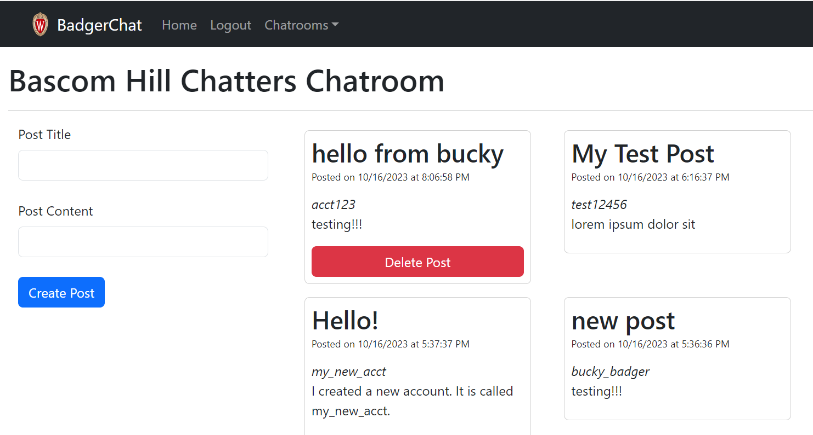
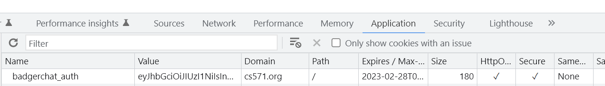

<br>

# **React 4**
### CS571: Building User Interfaces


<br>

#### Cole Nelson & Yuhang Zhao

---

# Today's Warmup

<div>

 - Clone [today's code](https://github.com/CS571-F23/week07-r4-example) to your machine.
    - Run the command `npm install` inside of the `starter` and `solution` folders.
 - Download the [HW6 Postman Collection](https://github.com/CS571-F23/week07-r4-example/blob/main/CS571%20F23%20HW6%20Shareable.postman_collection.json)

</div>

---

### Other Announcements

1. Get started on projects **early!**
  a. Done > Started > Empty
  b. Perfect === 🦄
2. Midterm exam is on Thursday, Oct 26th @ 5:45 pm.
  a. No class during the afternoon. 
  b. Old exams are on Canvas.
  c. You will have 1 hour for 30 MC problems.
  d. You may bring a **single-sided** notesheet.
  e. Conflict? [Let us know ASAP.](https://docs.google.com/forms/d/e/1FAIpQLSemwFFffIqYGMxh4TMaztOqVtqIbuD2KGstFJpdyEfdOmNrDQ/viewform)

---

# Last Time...
We covered routing and state sharing.

---

### Routing

We can create multi-page applications!

```jsx
<BrowserRouter>
  <Routes>
    <Route path="/" element={<Layout />}>
      <Route index element={<Home />} />
      <Route path="about-us" element={<AboutUs />} />
      <Route path="other-info" element={<OtherInfo />} />
      <Route path="*" element={<Home />} />
    </Route>
  </Routes>
</BrowserRouter>
```

---

### State Management

How do we talk back to our parent? How do siblings talk to each other?

<div>

 - Using callbacks
 - Using `useContext`
 - Using `sessionStorage` and `localStorage`
 - Using cookies and an API (next time!)
 - Using third-party libraries like (on your own!)...
   - [Redux](https://react-redux.js.org/), [Recoil](https://recoiljs.org/), [MobX](https://mobx.js.org/README.html), [XState](https://xstate.js.org/)

</div>

---

# How do we persist data...
...permanently? and share with others?

---

### What will we learn today?

<div>

 - How can we store data more persistently?
 - How do we work with "complex" APIs?
 - What are the differences between controlled and uncontrolled components?
   - How can we use `useRef`?
 - How to keep a secret? 🤫
 - What is "memoization"?

</div>

---

# Working with Complex APIs
Beyond GETting data...

---

### Scenario
You are building a database system. What operations should you allow a developer to perform?

---

### Scenario
You are building a database system. What operations should you allow a developer to perform?

<div>

 1. **C**reate data.
 2. **R**ead data.
 3. **U**pdate data.
 4. **D**elete data.

</div>

---

### CRUD Operations via HTTP

| CRUD Operation | HTTP Operation |
| --- | --- |
| Create | POST |
| Read | GET |
| Update | PUT |
| Delete | DELETE |

---

# HTTP Recap

Data is transmitted by requests and responses that allow us to create (POST), read (GET), update (PUT), and delete (DELETE) data!

---


<br><br><br><br><br><br><br><br><br>

[Image Source](https://www3.ntu.edu.sg/home/ehchua/programming/webprogramming/http_basics.html)

---


<br><br><br><br><br><br><br><br><br>

[Image Source](https://www3.ntu.edu.sg/home/ehchua/programming/webprogramming/http_basics.html)


---

### HTTP Recap

An HTTP request may have *path* and *query* parameters

```
https://www.example.com/packers/AaronRodgers/stats?all=true&since=2010
```

Here, `AaronRodgers` is a *path* parameter while `all` and `since` are *query* parameters.

Usage depends on the API documentation.

---

### HTTP Recap

HTTP requests (specifically `PUT` and `POST`) may also have a *request body*. This is located below the  headers.

```json
{
    "title": "Hello world!",
    "content": "abc123",
}
```

For a JSON body, we need an additional HTTP header.
`Content-Type: application/json`

---

### HTTP Status Codes

| HTTP Code | Response Type |
| --- | --- |
| 100s | Informational |
| 200s | Successful |
| 300s | Redirection |
| 400s | Client Error |
| 500s | Server Error |

---

### HTTP Specific Status Codes

| HTTP Code | Response |
| --- | --- |
| 200 | OK |
| 304 | Not Modified |
| 400 | Bad Request |
| 401 | Unauthorized |
| 404 | Not Found |
| 409 | Conflict |
| 413 | Request Entity Too Large |
| 500 | Internal Server Error |

---

### What is this "HTTPS" I hear about?

The "secure" version of HTTP.

Same thing as the HTTP protocol with end-to-end encryption. We use HTTPS for our API.

```json
{
  "username": "joe_schmoe21",
  "password": "mysecret123!"
}
```

This is only secure because of *HTTP**S***!

---

# Week 6 API
Use Postman to `POST` a ticket.

---

### Fetching w/ `POST`, `PUT`, and `DELETE`
`fetch` [can do a lot more](https://developer.mozilla.org/en-US/docs/Web/API/Fetch_API) than just retrieving data.

<div>

 - specify request method
 - specify request headers
 - specify request body
 - inspect response status
 - inspect response headers
 - inspect response body
 - ...and so much more!

</div>

---

```javascript
fetch("https://example.com/create-content", {
    method: "POST",
    headers: {
        "Content-Type": "application/json" // must include this header
    },
    body: JSON.stringify({ // must stringify
        content: "Hello World!"
    })
}).then(res => {
    if (res.status === 409) {
        alert("This content already exists!")
    }
    return res.json();
}).then(json => {
    if (json.msg) {
        alert(json.msg)
    }
});
```

---

### Your Turn!

Create *controlled* components for a user to type in their title and content.

When the user clicks "Create Ticket", `POST` the ticket to the API and reload the tickets on the screen.

---

### Detour: Uncontrolled Components

Sometimes, we care about listening to form changes.

Other times, **we don't**. Notice that we didn't care about the changes to *name* and *description*.

In cases like these, we can use *uncontrolled components*.

---

### Handling Text Input

We can get user input using the HTML `input` tag or the React-Bootstrap `Form.Control` component.

We can get user input...

 - in a *controlled* way using its `value` and tracking `onChange` events
 - in an *uncontrolled* manner using `useRef`.

---

### `useRef` Hook

Usually used to "reference" an input element.

```javascript
const inputVal = useRef();
return (
  <div>
    <label htmlFor="myInput">Type something here!</label>
    <input id="myInput" ref={inputVal}></input>
  </div>
);
```

The value of a ref can be retrieved via its `current` property, e.g. `inputVal.current.value`

---

### Controlled vs Uncontrolled Components

`useRef` is used to create a reference to an *uncontrolled* input component.

This is opposed to *controlling* an input component via its `value` and `onChange` properties.

[Example of an uncontrolled input component.](https://stackblitz.com/edit/react-dkpqwh)

[Example of a controlled input component.](https://stackblitz.com/edit/react-q134ha)

---

### Controlled vs Uncontrolled: Pros & Cons

[React generally recommends](https://reactjs.org/docs/forms.html) controlled components.

Controlled components can cause many re-renders, however uncontrolled components give you no control over the `onChange` property.

We'll practice using both.

---

### Input Best Practices

In either case, each `input` should have an `id` associated with the `htmlFor` of a `label`.

If you are using [react-bootstrap](https://www.npmjs.com/package/react-bootstrap) components, be sure each `Form.Control` has an `id` associated with the `htmlFor` of a `Form.Label`.

[Read more here.](https://react.dev/reference/react-dom/components/input#providing-a-label-for-an-input)

---

# HW6 Demo

BadgerChat! 🦡🗣️



---

# Credentialed Requests
Using cookies for a user's session.

---

### Secrets! Secrets!

Is there anything **special** about requests for logging in? Kind of! [We must include credentials.](https://developer.mozilla.org/en-US/docs/Web/API/Fetch_API/Using_Fetch#sending_a_request_with_credentials_included)

It varies from system to system, but typically we POST a username and password in the request body to an authentication endpoint and recieve a cookie.

e.g. `POST` `/register` or `POST` `/login`

---

### Secrets! Secrets!

These endpoints return a session for the user, in HW6 this is in the form of a cookie containing a JavaScript Web Token (JWT).

This is a temporary, all-access token for authenticating with the API. It is used in lieu of a username and password. Why might we do this?

---

### Secrets! Secrets!

A session is typically stored [in an http-only cookie](https://clerk.dev/blog/how-httponly-cookies-help-mitigate-xss-attacks).

An HTTP-Only cookie is not accessible by JavaScript.

###

Why might we want this?

---

### Secrets! Secrets!

Because `cs571.org` is a different domain than `localhost`, we must also *explictly* include credentials to every endpoint affecting authorization...

This includes logging in, logging out, and posting!

```javascript
fetch("https://example.com/api/submit", {
  method: "POST",
  credentials: "include",
  // ...
```

---

```javascript
fetch("https://example.com/create-content", {
    method: "POST",
    credentials: "include", // add this to requests related to cookies!
    headers: {
        "Content-Type": "application/json"
    },
    body: JSON.stringify({
        content: "Hello World!"
    })
}).then(res => {
    if (res.status === 409) {
        alert("This content already exists!")
    }
    return res.json();
}).then(json => {
    if (json.msg) {
        alert(json.msg)
    }
});
```

---

# Reading the Docs
Go over the [HW6 API documentation](https://github.com/CS571-F23/hw6-api/blob/main/API_DOCUMENTATION.md).

---

### Secrets! Secrets!

What's the benefit? The browser handles all things authentication! 🥳🎉




---

# HW6 Technical Demo
Go over the [HW6 API documentation](https://github.com/CS571-F23/hw6-api/blob/main/API_DOCUMENTATION.md) and use Postman.


---

# Memoization
Not memorization!

---

### Memoization

Storing the result so you can use it next time instead of calculating the same thing again and again

[what the frik is: memoization](https://whatthefuck.is/memoization)

###

`useCallback` to memoize functions
`useMemo` to memoize calculated values
`memo` to memoize components

---

### `useCallback` Hook

Consider the following functional component...

```javascript
function MyApp() {
  const myComplicatedFunction = () => {
    // ...
  }

  return <>
    <button onClick={myComplicatedFunction}>Click Me</button>
  </>
}
```

How many times do we *create* the function `myComplicatedFunction`? We do on *every render*!

---

### `useCallback` Hook

`useCallback` is used to ['memoize'](https://whatthefuck.is/memoization) a callback function.

```javascript
function MyApp() {
  const myComplicatedFunction = useCallback(() => {
    // ...
  }, []);

  return <>
    <button onClick={myComplicatedFunction}>Click Me</button>
  </>
}
```

Takes a callback function to 'memoize' and an optional list of dependencies (e.g. when to re-'memoize').

---

### `useMemo` Hook

Same thing as `useCallback`, except memoizes the *value* of a *callback* rather than the *callback* itself.

```javascript
function MyApp() {
  const myComplicatedValue = useMemo(() => { /* Some complex call */}, []);

  return <>
    <p>{myComplicatedValue}</p>
  </>
}
```

---

### `memo`-ized Components

Used for creating *purely functional* components. Given the same props, the function renders the same output.

```javascript
//                  v--- Name of functional component!
export default memo(GroceryList, (prevProps, nextProps) => {
  return prevProps.apples === nextProps.apples &&
    prevProps.bananas === nextProps.bananas &&
    prevProps.coconuts === nextProps.coconuts;
})
```

[See StackBlitz](https://stackblitz.com/edit/react-9nbqzn) for `useCallback`, `useMemo`, and `memo`

---


---


---

### Finding a Balance

1. Given the same input, renders the same output.
2. Is rendered often.
3. Does not change often.
4. Is of substantial size.

[Dmitri Pavlutin Blog Post](https://dmitripavlutin.com/use-react-memo-wisely/)


---

# Badger Bingo
Cumulative example, [see StackBlitz](https://stackblitz.com/edit/react-cucumq).


---

### What did we learn today?

<div>

 - How can we store data more persistently?
 - How do we work with "complex" APIs?
 - What are the differences between controlled and uncontrolled components?
   - How can we use `useRef`?
 - How to keep a secret? 🤫
 - What is "memoization"?

</div>

---

# Questions?