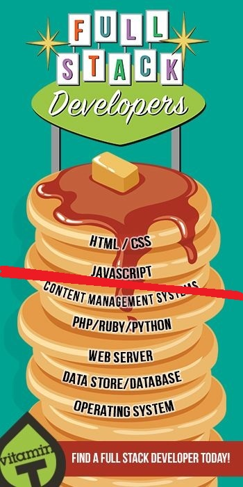
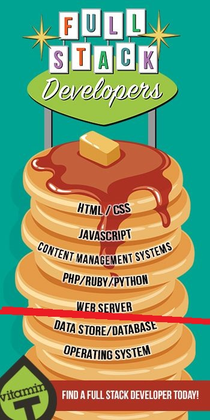
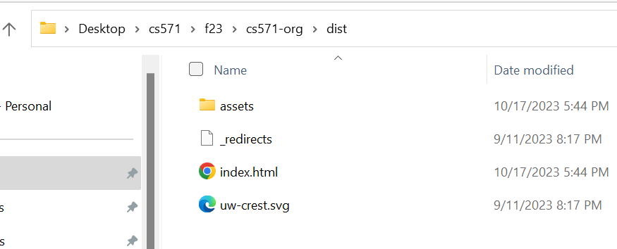
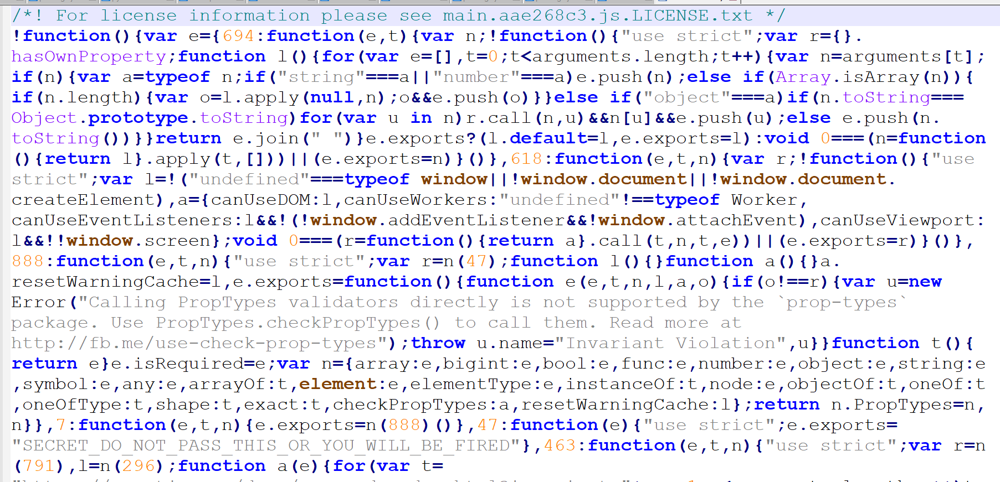
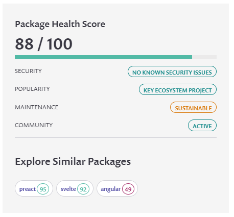
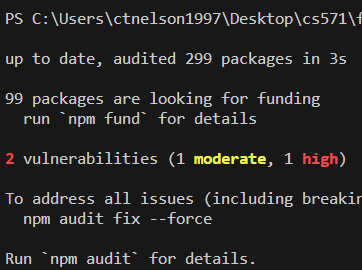

<br>

# **React 5**
### CS571: Building User Interfaces


<br>

#### Cole Nelson & Yuhang Zhao

---

# Today's Warmup

<div>

 - Clone [today's code](https://github.com/CS571-F23/week08-r5-example) to your machine.
    - Run the command `npm install` inside of the `starter` and `solution` folders.

</div>

---

### Announcements

Please complete the **mid-semester survey by tonight!**

Midterm exam is on Thursday, Oct 26th @ 6:00 pm.
  a. Try to show up by 5:45 pm.
  b. No class during the day.
  c. SEC001 (11 am) @ Social Science 6210
  d. SEC002 (4 pm) @ Van Vleck B130
  e. **Bring your Wiscard and a #2 pencil!**
  f. See Piazza for details.
  
---

# Memoization
Not memorization!

---

### Memoization

Storing the result so you can use it next time instead of calculating the same thing again and again

[what the frik is: memoization](https://whatthefuck.is/memoization)

###

`useCallback` to memoize functions
`useMemo` to memoize calculated values
`memo` to memoize components

---

### `useCallback` Hook

Consider the following functional component...

```javascript
function MyApp() {
  const myComplicatedFunction = () => {
    // ...
  }

  return <>
    <button onClick={myComplicatedFunction}>Click Me</button>
  </>
}
```

How many times do we *create* the function `myComplicatedFunction`? We do on *every render*!

---

### `useCallback` Hook

`useCallback` is used to ['memoize'](https://whatthefuck.is/memoization) a callback function.

```javascript
function MyApp() {
  const myComplicatedFunction = useCallback(() => {
    // ...
  }, []);

  return <>
    <button onClick={myComplicatedFunction}>Click Me</button>
  </>
}
```

Takes a callback function to 'memoize' and an optional list of dependencies (e.g. when to re-'memoize').

---

### `useMemo` Hook

Same thing as `useCallback`, except memoizes the *value* of a *callback* rather than the *callback* itself.

```javascript
function MyApp() {
  const myComplicatedValue = useMemo(() => { /* Some complex call */}, []);

  return <>
    <p>{myComplicatedValue}</p>
  </>
}
```

---

### `memo`-ized Components

Used for creating *purely functional* components. Given the same props, the function renders the same output.

```javascript
//                  v--- Name of functional component!
export default memo(GroceryList, (prevProps, nextProps) => {
  return prevProps.apples === nextProps.apples &&
    prevProps.bananas === nextProps.bananas &&
    prevProps.coconuts === nextProps.coconuts;
})
```

[See StackBlitz](https://stackblitz.com/edit/react-9nbqzn) for `useCallback`, `useMemo`, and `memo`

---


---


---

### Finding a Balance

1. Given the same input, renders the same output.
2. Is rendered often.
3. Does not change often.
4. Is of substantial size.

[Dmitri Pavlutin Blog Post](https://dmitripavlutin.com/use-react-memo-wisely/)


---

### Your turn!

Expand on our ticket tracking app from last week...

 1. Don't allow the user to post a message if it contains a bad word like "frik".
 2. Memoize! Use `useCallback`, `useMemo`, and `memo`

[Clone from here.](https://github.com/CS571-F23/week08-r5-example)

---

### What will we learn today?

<div>

 - How are legacy React apps made?
 - How can we write re-usable logic?
 - What is the bigger picture for React Apps?
 - What is the NPM community?
   - What makes a package "safe"?
 - Preparing for React Native...

</div>

---

### Legacy React Apps

Legacy React apps were class-based and had "lifecycle methods". We won't go into any more detail.

```javascript
class Welcome extends React.Component {
  constructor(props) {
    super(props);
    this.state = { counter: 0 };
    this.handleClick = this.handleClick.bind(this);
  }
  componentDidMount() { /* ... */ }
  handleClick() { /* ... */ }
  render() {
    return <h1>Hello World!</h1>;
  }
}
```

---

# How Can We Reuse Logic?
Practicing **D**on't **R**epeat **Y**ourself (DRY)

---

### Custom React Hooks

You can write your own custom hooks! These are just JavaScript functions that can use React's features!

 - We use **custom components** to re-use **UI elements**.
 - We use **custom hooks** to re-use **business logic**.

[JSConf Talk](https://www.youtube.com/watch?v=J-g9ZJha8FE)

---

# Let's Write a Custom Hook!
Writing reusable logic for persisting data.

<br>

[StackBlitz Solution](https://stackblitz.com/edit/react-yxigdl) | [Inspitation from WDS](https://blog.webdevsimplified.com/2019-11/how-to-write-custom-hooks/)

---

# Congrats!
You are now a React Devloper! 🥳🎊🎉

---

### Questions You Should Ask Yourself...
- What even is "frontend development"?
- Where does this fit in to the software stack?
- How can I get my web app out in front of customers?
- What concerns should I have about my web app?
- What else can I do with these skills?
- How much of a raise should I ask for? 💰

---

### Software Stack


Think of software like a stack of pancakes...

[Image Source](https://www.pinterest.com/pin/looking-for-a-full-stack-developer-weve-got-you-covered--456693218441395202/)

---

### Software Stack


... where each pancake can be its own flavor...

[Image Source](https://cookingwithmammac.com/flavored-pancakes/)

---

### Software Stack

... and can be cooked its own way...


[Image Source](https://www.liveworksheets.com/worksheets/en/English_as_a_Second_Language_(ESL)/Recipes/Lets_make_pancakes_ty1088539hd)

---

### Software Stack

... with as many or as few as we want!


[Image Source](https://www.goodhousekeeping.com/uk/food/a552834/this-stack-of-pancakes-has-2500-calories/)

---

### Software Stack

We typically refer to the "frontend" as the content that gets delivered to the user...



[Image Source](https://www.pinterest.com/pin/looking-for-a-full-stack-developer-weve-got-you-covered--456693218441395202/)

---

### Software Stack

...but this can change based on your perspective!



[Image Source](https://www.pinterest.com/pin/looking-for-a-full-stack-developer-weve-got-you-covered--456693218441395202/)

---

### The Browser


However, we are constrained to what the browser can interpret...

<div>

 - HTML
 - CSS
 - JS

</div>

---

# So... is React an Exception?
Facebook is influential, but not *that* influential!

---

### Reminder: JSX

This React component displays Hello World on the webpage using JSX.

```javascript
function Welcome() {
  return <h1>Hello World!</h1>;
}
```

This is transpiled into JS, CSS, and HTML.

---

### Delivery of React App
We don't deliver our JSX code, we deliver HTML, CSS, and JS generated via `npm run build`!

Also, specify a home page (absolute or relative)...

```json
{
  "name": "hw3",
  "version": "0.1.0",
  "private": true,
  "homepage": "https://coletnelson.us/mycoolapp/",
  "dependencies": {
    ...
  }
}
```

---

# What does this do?
Creates our "build bundle"...

---



---

```html
<!DOCTYPE html>
<html lang="en">
  <head>
    <meta charset="UTF-8" />
    <link
      rel="stylesheet"
      href="https://cdn.jsdelivr.net/npm/bootstrap@5.3.0/dist/css/bootstrap.min.css"
      integrity="sha384-9ndCyUaIbzAi2FUVXJi0CjmCapSmO7SnpJef0486qhLnuZ2cdeRhO02iuK6FUUVM"
      crossorigin="anonymous"
    />
    <link rel="icon" type="image/svg+xml" href="/uw-crest.svg" />
    <meta name="viewport" content="width=device-width, initial-scale=1.0" />
    <title>CS571</title>
    <script type="module" crossorigin src="/assets/index-10eed002.js"></script>
    <link rel="stylesheet" href="/assets/index-fe717832.css">
  </head>
  <body>
    <div id="root"></div>
  </body>
</html>

```

---



---

### Build Bundle Deployment

<br><br><br><br><br><br><br><br>


---

### Let's do a deployment!
... to [cs571.org](https://cs571.org)

---

### Let's do a deployment!
... locally!

```bash
docker run -dit --name my-apache-app -p 8080:80 -v "$PWD":/usr/local/apache2/htdocs/ httpd:2.4
```

[See the docs...](https://hub.docker.com/_/httpd)

---

### Concerns in Production...

<div>

 - Reliability
 - Performance
 - Monitoring
 - Business Value of Delivery
 - Search Engine Optimization (SEO)

</div>

---

### Reliability

Does our code work?

<div>

- Manual testing
- Automated testing
  - [Jest](https://jestjs.io/)
  - [React Testing Library](https://testing-library.com/docs/react-testing-library/intro/)
- Static analysis
  - [TypeScript](https://www.typescriptlang.org/): Used for type-checking
  - [ESLint](https://eslint.org/): Used for following best practice

</div>

---

### Performance

Does our code work *well*?

<div>

 - Be aware of the "bundle size"!
 - Our code specifically...
   - [Perf](https://reactjs.org/docs/perf.html)
   - [Profiler](https://reactjs.org/blog/2018/09/10/introducing-the-react-profiler.html)
 - Our code broadly...
   - [Google Lighthouse](https://developer.chrome.com/docs/lighthouse/overview/)
   - [Chrome User Experience Report (CrUX)](https://developer.chrome.com/docs/crux/)

</div>

---

### Monitoring

Does our code *continue to* work well?

<div>

 - Logging
   - *Not* `console.log`
   - [Sentry](https://sentry.io/welcome/)
   - [DataDog](https://www.datadoghq.com/)
 - Cloud Tools
   - Cloud Monitoring Tools
   - [DownDetector](https://downdetector.com/)

</div>

---

### Business Value of Delivery

<div>

 - Core Questions
   - Are we making money? 💸
   - Are users making use of new features?
 - Analysis Methods
   - [A/B Testing](https://vwo.com/ab-testing/)
   - [Customer Surveys](https://www.helpscout.com/blog/customer-survey/)
 - Commercial Tools
   - [Pendo](https://www.pendo.io/)

<div>

---

### Search Engine Optimization (SEO)
The generated HTML doesn't have much in it!

What is a search engine crawler supposed to do?

**Option:** Server Side Rendering [next.js](https://nextjs.org/)

---

# Your Considerations?

---

### Using NPM & Node.js

The `package.json` specifies details about the project.
The `package-lock.json` specifies specific details about dependencies.

`npm install` installs dependencies in `node_modules`.
`npm run dev` runs your webserver w/ hot-reloading!
`npm run build` generates your build bundle.

---

### Using NPM & Node.js

What's the difference?

<div>

 - **Node** is the **runtime engine**
 - **NPM** is the **package manager**

</div>

####

Other package managers such as [pnpm](https://pnpm.io/) and [yarn](https://yarnpkg.com/) exist.

---

### NPM Community

Choose your packages carefully!

<div>

 - Are they secure?
 - Are they well-documented?
 - Will they be maintained?

</div>


[A helpful tool!](https://snyk.io/advisor/npm-package/react)



---

### NPM Supply Chain Risk


Run `npm ls -all`.

Vulnerabilities are discovered over time.

Not all are true positive




---

### Contributing

Anyone can contribute!

Even the smallest contribution may be helpful :)


<sub><sup>[XKCD 2347](https://xkcd.com/2347/)</sup></sub>

---

# Up Next: React Native
[React Native in 100 seconds](https://www.youtube.com/watch?v=gvkqT_Uoahw)

---

### What did we learn today?

<div>

 - How are legacy React apps made?
 - How can we write re-usable logic?
 - What is the bigger picture for React Apps?
 - What is the NPM community?
   - What makes a package "safe"?
 - Preparing for React Native...

</div>

---

# Questions?