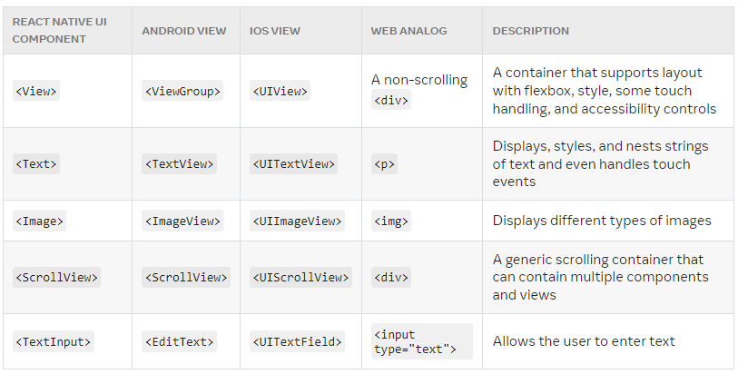
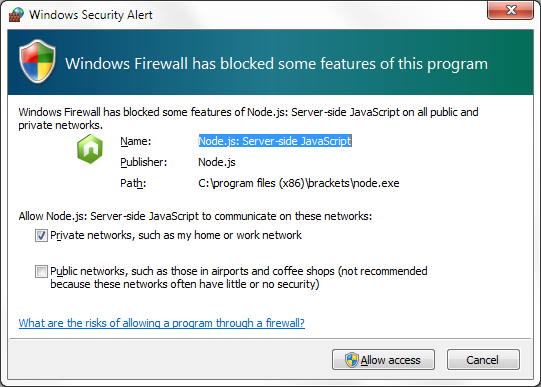
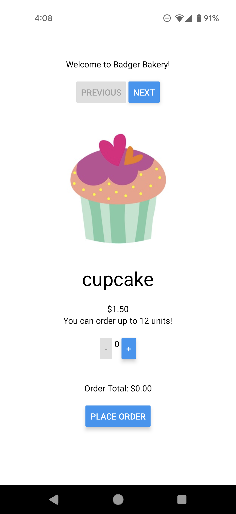

<br>

# **React Native 1**
### CS571: Building User Interfaces


<br>

#### Cole Nelson & Yuhang Zhao

---

### Today's Warmup


 - Download Expo for your mobile device (see next slide for details).
 - Clone [today's code](https://github.com/CS571-F23/week09-rn1-example) to your machine.
    - Run the command `npm install` inside of the `starter` and `solution` folders.
 - **Optional:** Set `EXPO_PUBLIC_CS571_BADGER_ID` to be your Badger ID!
    - This may require a restart.

---

### Download Expo

Download Expo!
 - Download for [iOS](https://apps.apple.com/us/app/expo-go/id982107779)
 - Download for [Android](https://play.google.com/store/apps/details?id=host.exp.exponent&hl=en_US&gl=US)
 - Don't have a smart phone? You can use an emulator like [AVD](https://developer.android.com/studio/run/managing-avds) or [XCode](https://developer.apple.com/xcode/)


---

### Announcements

Thank you for the mid-semester feedback!

Great job on the midterm!
 - Scores will be released in the next week.
 - Final Exam will be 40 multiple-choice worth 20 pts over 90 minutes with a double-sided notesheet.

**Academic Integrity Matters**

---

# Midterm Exam Review

See Canvas.

---

### What will we learn today?

<div>

 - What is mobile development?
 - How does React Native fit into mobile development?
 - How can we use React Native and Expo?

</div>

---

# Mobile Development
Native development and its alternatives

---

### What is "True Native" Development?

Building specifically for the device (e.g. Android or iOS) that you want to support.

**iOS**: Objective-C or Swift w/ Cocoapods
**Android**: Java or Kotlin w/ Maven or Gradle

---

### Pros and Cons of True Native

**Pros**

<div>

 - Organic User Experience
 - Optimized Apps
 - Fine-Grained Control

</div>

**Cons**

<div>

 - Expensive
 - Little Code Reuse
 - Less Sense of Abstraction

 </div>

---

### Alternatives to True Native

**No mobile app!** Do we really need an app? Could a responsive webpage be just as effective?

**WebView!** Can we take our existing code and just slap it into a WebView? e.g. Apache Cordova

**Cross-Platform!** Can we use a library or framework that will make our code work natively on Android *and* iOS? e.g. React Native


---

### Who is using React Native?

<div>

 - Facebook
 - Microsoft
 - Shopify
 - Coinbase
 - Discord
 - Dave

</div>

[... among many others](https://reactnative.dev/showcase). Other companies may be doing pure-native or hybrid development.


---

### What is React Native?

A JS framework for building native, cross-platform mobile applications using React, developed by Facebook in 2015.

Unlike ReactJS, which was a library, React Native is a framework that includes everything* that we will need to build mobile applications.

React Native supports iOS and Android development.

---


<br><br><br><br><br><br><br><br><br><br>

[Image Source](https://reactnative.dev/docs/intro-react-native-components)

---

### React Native


 - No more browser!
 - No more DOM!
 - Hermes is used to translate your JS components to iOS/Android components.

[Image Source](https://formidable.com/blog/2019/lean-core-part-4/)


---

<div class="center-info">

# React Native
React for Mobile Devices!

</div>

---

<div class="center-info">


[React Native in 100 seconds](https://www.youtube.com/watch?v=gvkqT_Uoahw)

</div>

---

### A Review of *Implementation* So Far

 | Lecture | Takeaway |
 | --- | --- |
 | Intro | The web runs on HTTP |
 | JS1 | Basics of HTML, CSS, and JS |
 | JS2 | APIs and Declarative Programming|
 | JS3 | Data Copying and Bootstrap |

---

### A Review of *Implementation* So Far

 | Lecture | Takeaway |
 | --- | --- |
 | React 1 | Intro, useState, and useEffect |
 | React 2 | Many Components and Controlled Inputs |
 | React 3 | State Management, Context, and Routing |
 | React 4 | Complex APIs and Secret Management |
 | React 5 | Memoization, Deployment, and NPM |

---

### What stays the same?

<div>

 - Using NPM for our library management
 - Using complex APIs
 - Core React features
   - React Hooks (useEffect, useState, etc.)
   - Passing props and state management
   - Controlled vs Uncontrolled Inputs
   - Memoization

</div>


---

### What changes?
 - This isn't a browser!
   - No more DOM!
   - No more CSS!
     - No more Bootstrap!
   - No more sessionStorage, localStorage, or cookies.
 - Wider variety of inputs
   - Sensors
   - Gestures
 - [React Navigation](https://reactnavigation.org/) vs [React Router](https://reactrouter.com/en/main)

---

### Conversions to Know



<br><br><br><br><br><br><br><br>

[Image Source](https://reactnative.dev/docs/intro-react-native-components)

---

### Other Good Questions to Ask...

<div>

 - Can we declaratively program using RN? **YES**
 - Can we use JSX with RN? **YES**
 - Can we use React hooks in RN? **YES**
 - Can we do styling in RN? **YES**-ish
 - Is it *truly* cross-platform? **MAYBE**-ish

</div>

---


### Hello World!

```javascript
import React from 'react';
import { Text, View } from 'react-native';

function MyApp() {
  return (
    <View style={{ flex: 1, justifyContent: "center", alignItems: "center" }}>
      <Text>
        Try editing me! 🎉
      </Text>
    </View>
  );
}

export default MyApp;
```

[Expo Snack](https://snack.expo.dev/@ctnelson1997/hello-world)


---

# React Native for React Devs
How can we write our mobile apps with React Native?

---

### Getting Started

Using [Expo](https://expo.dev/), similar to vite!

Run for each new project...

```bash
npx create-expo-app my-cool-app
cd my-cool-app
npm start
```

---

### Getting Started: A Special Note

By default, Expo uses "lan" to host your app. This may cause issues on certain networks. Try using "localhost" or "tunnel" by modifying scripts of `package.json`...

```bash
"scripts": {
  "start": "expo start --localhost",
  "android": "expo start --android",
  "ios": "expo start --ios",
  "web": "expo start --web"
}
```

You will need to be wired in to your computer!

---

### Getting Started: Another Note

Your computer will act like a server for your phone; be sure to allow connections!



---

### Styling

Because React Native does not use a "browser", we can't use CSS styles. Instead, we create JavaScript stylesheets.

```javascript
const styles = StyleSheet.create({
  container: {
    flex: 1,
    justifyContent: 'center',
    backgroundColor: '#ecf0f1',
    padding: 40,
  },
  ...
});
```

---

### Styling

Style definitions can be done inline or via stylesheets. You can also combine both methods.

```javascript
<View>
 <Text style={styles.label}>First label</Text>
 <Text style={{fontSize: 28, color:'tomato'}}>Second label</Text>
 <Text style={[styles.label, {fontSize: 20, color:'gray'}]}>Third label</Text>
</View>
```

[Snack Solution](https://snack.expo.dev/@ctnelson1997/styling)

---

### Images

`Image` not `img` (must be imported!)

Must specify a width and height: the default is 0!

`source` not `src` which takes an object (not a string)

```jsx
<Image
  style={{
    width: 100,
    height: 100
  }}
  source={{
    uri: "https://example.com/me.png"
  }}
/>
```

---

### Buttons

Two minor changes...

<div>

 - `title` is specified with a prop
 - `onPress` rather than `onClick`

</div>

####

```jsx
<Button title="Speak!" onPress={doSpeak}/>
```

Also, anything can be made a `Pressable`... we'll cover this next time!

---

# Expo Demo
Tackling HW7...



---

### Your Turn!

Using [today's starter code](https://github.com/CS571-F23/week09-rn1-example)...

1. Get your expo app running!
2. Display the bio data to the phone screen.
3. When the button is pressed, display a message from the API.

```
https://cs571.org/api/f23/weekly/week09/bio
https://cs571.org/api/f23/weekly/week09/message
```

---

### What did we learn today?

<div>

 - What is mobile development?
 - How does React Native fit into mobile development?
 - How can we use React Native and Expo?

</div>

---

# Questions?
