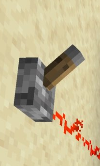
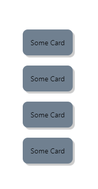

<br>

# **React Native 2**
### CS571: Building User Interfaces


<br>

#### Cole Nelson & Yuhang Zhao

---

### Today's Warmup


 - Set back and relax! :)
 - We'll try our in-class activity through "Expo Snacks" today instead of downloading starter code.
---

### Badger IDs

Okay to hardcode them!

Otherwise, set an environment variable `EXPO_PUBLIC_CS571_BADGER_ID` to be your Badger ID.

```jsx
import CS571 from '@cs571/mobile-client'

// ...

CS571.getBadgerId() // returns ID
```

May require a restart!

---

### What will we learn today?

<div>

 - What are other core concepts in React Native?
   - How can we do dynamic display?
   - What are Switch, ScrollView, Card, and Pressable?
 - How can we perform animations?
 - How can we perform navigation?

</div>

---

### What is React Native?

A JS framework for building native, cross-platform mobile applications using React, developed by Facebook in 2015.

Unlike ReactJS, which was a library, React Native is a framework that includes everything* that we will need to build mobile applications.

React Native supports iOS and Android development.


---

### Hello World!

```javascript
import React from 'react';
import { Text, View } from 'react-native';

function MyApp() {
  return (
    <View style={{ flex: 1, justifyContent: "center", alignItems: "center" }}>
      <Text>
        Try editing me! 🎉
      </Text>
    </View>
  );
}

export default MyApp;
```

[Expo Snack](https://snack.expo.dev/)

---

# Issues with Cross-Platform
How can differentiate based on platform?

<div>

 - e.g. iOS vs Android

</div>

###

How can we adjust to the size of the device? 

<div>

 - e.g. iPhone vs iPhone SE vs iPhone XL

</div>

---

### Cross-Platform: By Platform

React Native provides a number of components that utilize platform capabilities that may not be available in other platforms, thus for cross-platform development, we need to utilize multiple platform-specific components.

e.g. `TouchableNativeFeedback` only works on Android; a *similar* effect can be achieved using `TouchableHighlight` on iOS.

---

### Cross-Platform: By Platform

```javascript
if (Platform.OS === 'android') {
  return (
    <TouchableNativeFeedback> ... </TouchableNativeFeedback>
  );
} else {
  return (
    <TouchableHighlight> ... </TouchableHighlight>
  );
}
```

Optionally, create two components e.g. `MyButton.ios.js` and `MyButton.android.js.`

[Snack Solution](https://snack.expo.dev/@ctnelson1997/platform-specific-components-snack)

---

### Cross-Platform: By Size

Mobile devices vary significantly in screen size, and we open need to obtain screen dimensions of the device using the `Dimensions` class in `react-native`.

```javascript
const getScreenSize = () => {
 const screenWidth = Math.round(Dimensions.get('window').width);
 const screenHeight = Math.round(Dimensions.get('window').height);
 return { screenWidth: screenWidth, screenHeight: screenHeight };
} 
```

[Snack Solution](https://snack.expo.dev/@ctnelson1997/dimensions)

---

# React Native Components
What are other common components we will be using?

<div>

 - Switch
 - ScrollView
 - Pressable
 - Card (not actually in React Native!)


</div>

---

### Switch




A `Switch` is on or off.

<div>

 - `value` boolean value of on/off
 - `onValueChange` callback function

</div>

---

### Switch

```jsx
<Switch
  trackColor={{true: 'darksalmon', false: 'lightgrey'}}
  thumbColor={isOn ? 'crimson' : 'grey'}
  onValueChange={toggle} // callback function
  value={isOn} // boolean state variable
/>
```

[Snack Solution](https://snack.expo.dev/@ctnelson1997/switch)

---

### ScrollView

Like a `View`, but scrollable! Make sure that it is in a view that is flex-ible.

```jsx
<View style={{flex: 1}}>
  <ScrollView>
    { /* A bunch of content here! */ }
  </ScrollView>
</View>
```

[Snack Solution](https://snack.expo.dev/@ctnelson1997/find-my-badgers)

---

### Card

React Native does not have the concept of a "card"...

1. Use a third-party library like [`react-native-paper`](https://callstack.github.io/react-native-paper/4.0/card.html).

2. Create our own component!




---

### Card

```jsx
export default function BadgerCard(props) {
    return <Pressable onPress={props.onPress}>
        <View style={[styles.card, props.style]}>
            {props.children}
        </View>
    </Pressable>
}
```

[Pressable](https://reactnative.dev/docs/pressable) | [React Native Paper Card](https://callstack.github.io/react-native-paper/4.0/card.html)

---

### Card

Adding in the `styles.card`...

```jsx
const styles = StyleSheet.create({
    card: {
        padding: 16,
        elevation: 5,
        borderRadius: 10,
        backgroundColor: 'slategray',
    }
})
```

---

### Card

Using the BadgerCard...

```jsx
function App() {
  return <View style={styles.main}>
    <BadgerCard
      onPress={() => Alert.alert("Hello", "World!")}
      style={{backgroundColor: "red"}}
    >
      <Text>Testing Custom Card</Text>
    </BadgerCard>
  </View>
};
```

---

### Adding Gestures

```jsx
export default function BadgerCard(props) {
    return <Pressable
      onPress={props.onPress}
      onLongPress={props.onLongPress}
    >
        <View style={[styles.card, props.style]}>
            {props.children}
        </View>
    </Pressable>
}
```

[Snack Solution](https://snack.expo.dev/@ctnelson1997/badgercard)

---

# Animations

Providing *feedback* in a *visually aesthetic* way.

---

### Animations using `Animated`

Providing *feedback* in a *visually aesthetic* way.

```jsx
import { Animated } from 'react-native'
```

May also consider using a third-party-library like [react-native-reanimated](https://www.npmjs.com/package/react-native-reanimated).

[Animated Docs](https://reactnative.dev/docs/animated)

---

### Animated

`Animated` provides animations for...

<div>

 - `View`
 - `Text`
 - `Image`
 - `ScrollView`
 - `FlatList` (similar to a ScrollView)
 - `SectionList` (similar to a ScrollView)

</div>

... e.g. `<Animated.View>{/* ... */}</Animated.View>`

---

### Animated

These are animated using...

<div>

 - `Animated.timing`, 
 - `Animated.spring`
 - `Animated.decay`
 
</div>

... which manipulate an `Animated.Value`, e.g.

```jsx
Animated.timing(opVal, {
  toValue: 1,
  duration: 10000, // in ms
  useNativeDriver: true // must include
})
```

---

### Animated

`Animated.Value` is used in combination with [useRef](https://react.dev/reference/react/useRef).

```jsx
const opVal = useRef(new Animated.Value(0)).current
```

To run an animation on page load...

```jsx
useEffect(() => {
  Animated.timing(opVal, {
    toValue: 1,
    duration: 10000,
    useNativeDriver: true
  }).start() // don't forget this!
}, [])
```

---

```jsx
export default function FadeInView(props) {
  const opVal = useRef(new Animated.Value(0)).current;
  useEffect(() => {
    Animated.timing(opVal, {
      toValue: 1,
      duration: 5000,
      useNativeDriver: true,
    }).start();
  }, []);
  return (
    <View>
      <Animated.View
        style={{
          height: 100, width: 100, opacity: opVal
          backgroundColor: "cyan",
        }}>
      </Animated.View>
    </View>
  );
}
```

[Expo Snack](https://snack.expo.dev/@ctnelson1997/simple-animation)


---

### Animated

Can control many animations using...

<div>

 - `Animated.parallel`
 - `Animated.sequence`
 - `Animated.loop`

</div>

###

`start()` and `stop()` apply to the set of animations

---

In parallel...

```jsx
useEffect(() => {
  Animated.parallel([
    Animated.timing(height, {
      toValue: 800,
      duration: 10000,
      useNativeDriver: false, // cannot use native driver for height/width!
    }),
    Animated.timing(width, {
      toValue: 500,
      duration: 10000,
      useNativeDriver: false,
    })
  ]).start()
}, []);
```

---

In sequence...

```jsx
useEffect(() => {
  Animated.sequence([
    Animated.timing(sizeVal, {
      toValue: 500,
      duration: 10000,
      useNativeDriver: false,
    }),
    Animated.timing(sizeVal, {
      toValue: 0,
      duration: 10000,
      useNativeDriver: false,
    })
  ]).start()
}, []);
```

---

In loop...

```jsx
useEffect(() => {
  Animated.loop( // not an array!
    Animated.sequence([
      Animated.timing(sizeVal, {
        toValue: 500,
        duration: 10000,
        useNativeDriver: false,
      }),
      Animated.timing(sizeVal, {
        toValue: 0,
        duration: 10000,
        useNativeDriver: false,
      })
    ])
  ).start()
}, []);
```

---

# Animated Demo
[Expo Snack](https://snack.expo.dev/@ctnelson1997/animated-example)

---

### Animated

You cannot *directly* add/subtract/multiply/divide `Animated.value`. Instead, you must use...

<div>

 - `Animated.add(v1, v2)`
 - `Animated.subtract(v1, v2)`
 - `Animated.multiply(v1, v2)`
 - `Animated.divide(v1, v2)`

</div>

---

### Animated

e.g. start at 50 and grow from there.

```jsx
<Animated.View
  style={{
    backgroundColor: "blue",
    height: Animated.add(height, 50),
    width: Animated.add(width, 50)
  }}>
</Animated.View>
```

---

### Your turn!

Take [this snack](https://snack.expo.dev/@ctnelson1997/find-my-badgers) and make it so that the Badgers fade in as they are added.

**Hint:** Only change the `Badger` component.

[Expo Solution](https://snack.expo.dev/@ctnelson1997/find-my-badgers-animated)

---

# Navigation in React Native
A more mobile-centric library.

---

### React Navigation Alternatives

React Native is a framework* but still lacks support for things like navigation.

<div>

 - [React Router](https://reactrouter.com/en/main) previously!
 - [React Navigation](https://reactnavigation.org/) new!
 - `return isHome ? <HomeScreen> : <SettingsScreen>`
 - Other outdated libraries...

</div>

---

### React Navigation Installation

Just a few dependencies...

```bash
npm install @react-navigation/native react-native-screens react-native-paper 
react-native-safe-area-context react-native-gesture-handler
react-native-reanimated  @react-navigation/native-stack 
@react-navigation/drawer @react-navigation/bottom-tabs
```

**This is done for you on the homeworks.**

Beware of your auto-imports!

---

### React Navigation

We will use...

- Tab Navigation: `@react-navigation/bottom-tabs`
- Drawer Navigation: `@react-navigation/drawer`
- Stack Navigation: `@react-navigation/native-stack `


...others exist!

---

### Navigation Basics

<div>

 - Must be nested inside of a `NavigationContainer`
 - Create navigators via a function `createNAVIGATOR()` e.g. `createBottomTabNavigator()`
 - Navigators consist of a *navigator* and a set of *screens*

 ```javascript
<NavigationContainer>
  <SomeNav.Navigator>
    <SomeNav.Screen name="Bookstore" component={BookstoreScreen}/>
    <SomeNav.Screen name="Book" component={BookScreen}/>
  </SomeNav.Navigator>
</NavigationContainer>
 ```


</div>


---

### Navigation Basics

 - `useNavigation` is a custom React hook that can be used to help us navigate
   - Supports `navigate`, `reset`, `goBack` among others
 - Information can be passed from screen to screen via *route params* (see Native Stack Navigator example)
 - Navigators can be styled
 - Navigators can be nested

---

### Tab Navigation

```javascript
const SocialTabs = createBottomTabNavigator();

<NavigationContainer>
  <SocialTabs.Navigator>
    <SocialTabs.Screen name="NewsFeed" component={NewsFeedScreen}/>
    <SocialTabs.Screen name="Notifications" component={NotificationScreen}/>
    <SocialTabs.Screen name="AboutMe" component={AboutMeScreen} />
  </SocialTabs.Navigator>
</NavigationContainer>
```

[Expo Snack Solution](https://snack.expo.dev/@ctnelson1997/tab-navigation)

---

### Drawer Navigation

```javascript
const SocialDrawer = createDrawerNavigator();

<NavigationContainer>
  <SocialDrawer.Navigator>
    <SocialDrawer.Screen name="NewsFeed" component={NewsFeedScreen}/>
    <SocialDrawer.Screen name="Notifications" component={NotificationScreen}/>
    <SocialDrawer.Screen name="AboutMe" component={AboutMeScreen} />
  </SocialDrawer.Navigator>
</NavigationContainer>
```

[Expo Snack Solution](https://snack.expo.dev/@ctnelson1997/drawer-navigation)

---

### Stack Navigation

```javascript
const BookStack = createNativeStackNavigator();

<NavigationContainer>
  <BookStack.Navigator>
    <BookStack.Screen name="Bookstore" component={BookstoreScreen}/>
    <BookStack.Screen name="Book" component={BookScreen}/>
  </BookStack.Navigator>
</NavigationContainer>
```

[Expo Snack Solution](https://snack.expo.dev/@ctnelson1997/stack-navigation)

---

### Stack Navigation

Can push a screen onto the history stack via `navigation.push(screenName, params)`
 - `screenName` is the name of the screen to navigate to, e.g. `Book`
 - `params` is an optional object of parameters to pass to the receiving screen.
 - `params` is recieved  as `props.route.params`

---

### Nested Navigation

<div>

 - Navigators can be nested.
   - Stack in Tabs
   - Stack in Drawer
   - Stack in Tabs in Drawer (e.g. Example Below)
   - Stack in Stack in Tabs
   - Stack in Stack in Stack in Stack in Stack
 - Make use of the `headerShown` option!

</div>

[Expo Snack Solution](https://snack.expo.dev/@ctnelson1997/nested-navigation)

---

### What did we learn today?

<div>

 - What are other core concepts in React Native?
   - How can we do dynamic display?
   - What are Switch, ScrollView, Card, and Pressable?
 - How can we perform animations?
 - How can we perform navigation?

</div>

---

# Questions?
