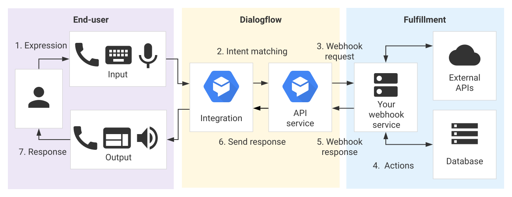
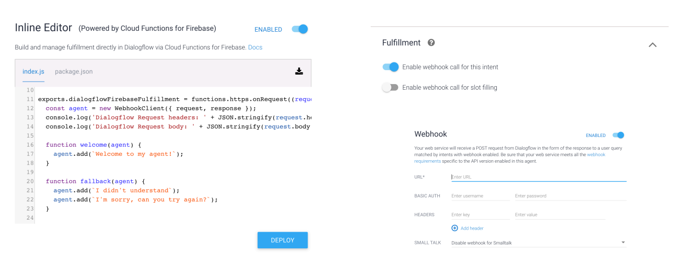
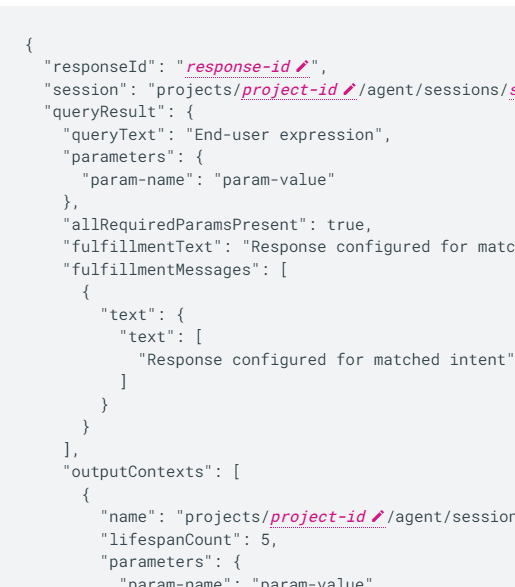
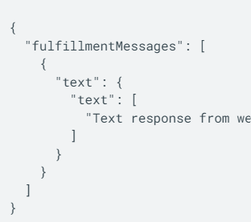
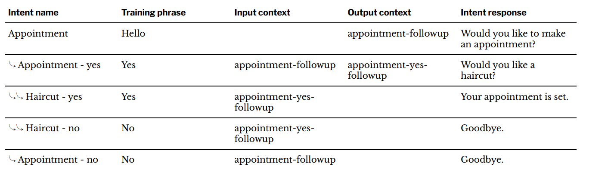
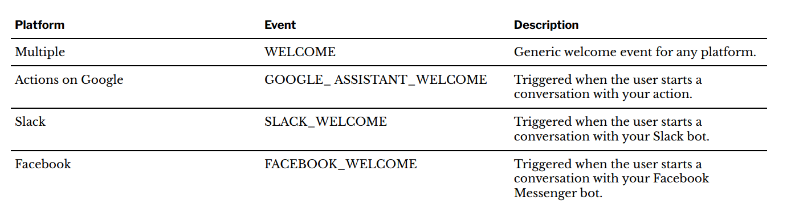
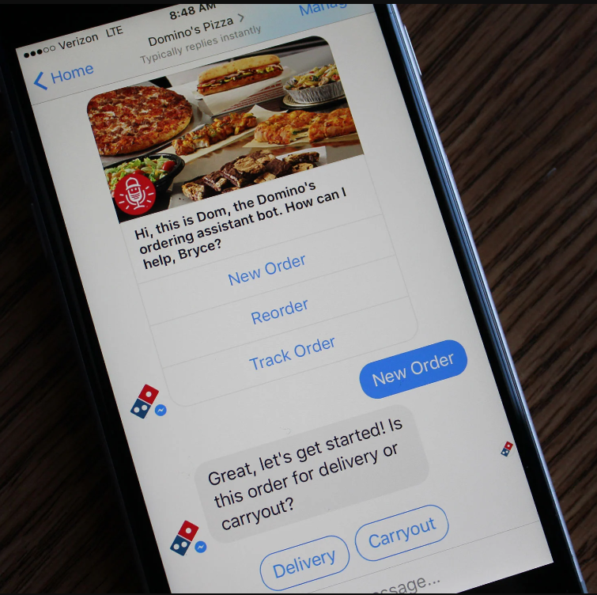
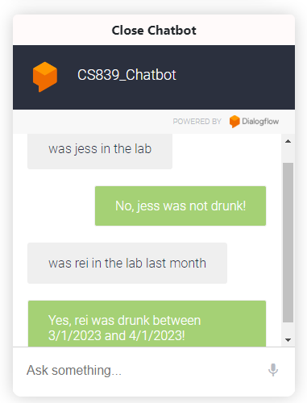
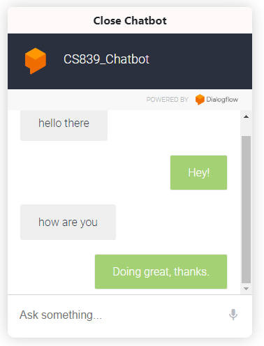

# **DialogFlow 2**
### CS571: Building User Interfaces

###

#### Cole Nelson & Yuhang Zhao

---

### Before Lecture

1. Signup for an [ngrok account](https://ngrok.com/)
2. Clone [today's starter code](https://github.com/CS571-F23/week13-df2-example) and run `npm install` in the starter and solution folders.

---

### What will we learn today?

<div>

 - A review of DialogFlow.
 - How can we perform DialogFlow fullfillment?
 - What is `async` / `await`?
 - How can we followup via context?
 - What are other neat DialogFlow features?

</div>

---

### Key Concepts in DialogFlow

<div>

 - Agents
   - Intents
     - Training Phrases
     - Parameters
     - Responses
   - Entities

</div>


---

### Intents

**Training Phrases:** Things the user may say to express an intent. DialogFlow recommends having many!

**Parameters:** Things that may vary in an expression, e.g. time, quantity, location.

**Responses**: How the system responds to the expression. Can include text, buttons, links, etc!

---


<br/><br/><br/><br/><br/><br/><br/><br/><br/>

[Image Source](https://cloud.google.com/dialogflow/es/docs/intents-overview)


---

### Parameters, Entity Types, and Entities

These allow for more specificity of requests without exploding the intent space.

<div>

 - **Parameter:** A variable to be expressed by the user
 - **Entity Type:** The type of variable expressed
 - **Entity:** A specific value that can be expressed

</div>


---

### DialogFlow Advanced Concepts

<div>

 - WebHook Fulfillment
 - Contexts
   - Followup Intents
 - Events
 - Integrations

</div>

---

# Let's Start!
**Your turn!** [Clone today's starter code](https://github.com/CS571-F23/week13-df2-inclass-example) and import the starter jokes agent.

---

# Webhook Fulfillment
Doing something "smart" with our agent.

---



<br/><br/><br/><br/><br/><br/><br/><br/><br/>

[Image Source](https://cloud.google.com/dialogflow/es/docs/fulfillment-overview)


---

### Types of Webhook Fulfillment




---

### DialogFlow Webhook

DialogFlow makes a POST *request* to `/`.



[Explore Docs](https://cloud.google.com/dialogflow/es/docs/fulfillment-webhook#webhook_request)

---

### DialogFlow Webhook

DialogFlow expects a *response* of a certain format.



[Explore Docs](https://cloud.google.com/dialogflow/es/docs/fulfillment-webhook#webhook_response)

---

### Accessing Our Webhook

We are running a server on localhost... how can we tell DialogFlow where to `POST`?

Solution: [ngrok](https://ngrok.com/) (or any reverse-proxy service)

```
https://088b-146-151-104-188.ngrok.io -> http://localhost:53705
```

**Pro-Tip:** You can use this with your React apps!

---

### Intent Mapping

```javascript
const intentMap = {
  "GetNumUsers": getNumUsers,
  "GetNumMessages": getNumMsgs,
  "GetChatroomMessages": getChatMsgs
}

app.post('/', (req, res) => {
  const intent = req.body.queryResult.intent.displayName;
  if (intent in intentMap) {
    intentMap[intent](req, res);
  } else {
    console.error(`Could not find ${intent} in intent map!`)
    res.status(404).send(JSON.stringify({ msg: "Not found!" }));
  }
})
```

---

### Responding to Request

```javascript
function getNumUsers(req, res) {
  // TODO Fetch data from API
  res.status(200).send({
    fulfillmentText: "Hello from getNumUsers!"
  });
}
```

---


### Responding to Request - Alternative

```javascript
function getNumUsers(req, res) {
  // TODO Fetch data from API
  res.status(200).send({
    fulfillmentMessages: [
      {
        text: {
          text: [
            `Hello from getNumUsers!`
          ]
        }
      }
    ]
  });
}
```

---

### Responding to Request - Card

```javascript
function getNumUsers(req, res) {
  // TODO Fetch data from API
  res.status(200).send({
    fulfillmentMessages: [
      {
        card: {
          title: "Hello",
          subtitle: "World",
          buttons: [
            {
              text: "Click Me",
              postback: "https://example.com/"
            }
          ]
        }
      }
    ]
  });
}
```

---

# Let's Build a Better Agent!
**Your turn!** Signup for an [ngrok account](https://ngrok.com/) and place [your authtoken](https://dashboard.ngrok.com/get-started/your-authtoken) in a file called `token.secret`.

Run `npm start` in one terminal.

Run `npm run tunnel` in another terminal.

(Be sure to run `npm install` before either of these!)

---

### A Review of Async

**Definition:**  not happening or done at the same time.

<br/>

We `promise` something will happen in the future.

If we fulfill our promise, `then` we do something.

Otherwise, we `catch` and handle the error.

---

### `async`/`await`

##

<div>

 - equivalent way to handle asynchronous behavior
 - `await` must be inside of an `async` function or at the top-level of the program
 - `await` waits for right-hand-side to complete
 - every `async` function returns a `Promise`
 - a synchronous function may spawn `async` behavior
 - an `async` function always happens asynchronously

<div>

---

### Equivilant Handling!

```javascript
function getLogos() {
  fetch("https://www.example.com/logos?amount=20")
  .then(res => res.json())
  .then((newLogos) => {
      setLogos(newLogos);
  })
}
```

```javascript
async function getLogos() {
  const resp = await fetch("https://www.example.com/logos?amount=20");
  const newLogos = await resp.json();
  setLogos(newLogos); 
}
```

---

### Equivilant Handling - Errors

```javascript
function getLogos() {
  fetch("https://www.example.com/logos?amount=20")
  .then(res => res.json())
  .then((newLogos) => {
      setLogos(newLogos);
  })
  .catch(e => alert("Something went wrong!"))
}
```

---

### Equivilant Handling - Errors

```javascript
async function getLogos() {
  try {
    const resp = await fetch("https://www.example.com/logos?amount=20");
    const newLogos = await resp.json();
    setLogos(newLogos); 
  } catch (e) {
    alert("Something went wrong!")
  }
}
```

---

# Let's Build a Better Agent!
Using `async`/`await`...

---

### Context

Context is the common ground that communicators have about the conversation that allows them to infer ambiguous speech such as "pass me that."

Contexts allow us to control the order of intent matching and define different behaviors for intents with the same training phrases.

---

### Context

The training phrase "My balance" only makes sense in the context of CheckingInfo.

[Image Source](https://cloud.google.com/dialogflow/es/docs/contexts-overview)


---

### Contexts

Intents have **input** and **output** contexts.

A context has a **lifespan**. The lifespan may be defined in terms of **time** or **turns**.

A context can be **added** or **removed** by an intent.

---

Can also be used to make *followup intents*.


<br/><br/>
<br/>
<br/>
<br/>
<br/>




---

### Let's Build an Even Better Agent!
Using context...

---

### Events

Events are triggered by actions users take on platforms that Dialogflow interacts with, such as Google Assistant, Slack, and Facebook Messenger.



---

### Integrations

DialogFlow agents can be integrated with other platforms such as Google Assistant, Slack, and  Messenger.



[Image Source](https://techcrunch.com/wp-content/uploads/2017/02/dominos-bot-ios.jpg)

---

### Integrations

Can also be embedded as an `iframe`...

```html
<iframe
  allow="microphone;"
  width="350"
  height="430"
  src="https://console.dialogflow.com/
    api-client/demo/embedded/xxxxxxxx">
</iframe>
```



---

### Integrations

[SmallTalk](https://cloud.google.com/dialogflow/es/docs/agents-small-talk) is used to provide responses to casual conversation.




---

### HW11 Sneak Peak

Use DialogFlow to create a voice agent for navigating BadgerChat...

<div>

 - Read-only
 - Use Dialogflow Agent for Steps 1-5
 - Use a Webhook for Steps 6-7

</div>

You will have completed a web, mobile, and voice application for the same service! 🥳

**Use DialogFlow ES Trial Edition!**

---


### What did we learn today?

<div>

 - A review of DialogFlow
 - How can we perform DialogFlow fullfillment?
 - What is `async` / `await`?
 - How can we followup via context?
 - What are other neat DialogFlow features?

</div>

---

# Questions?
