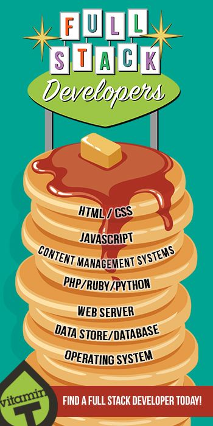
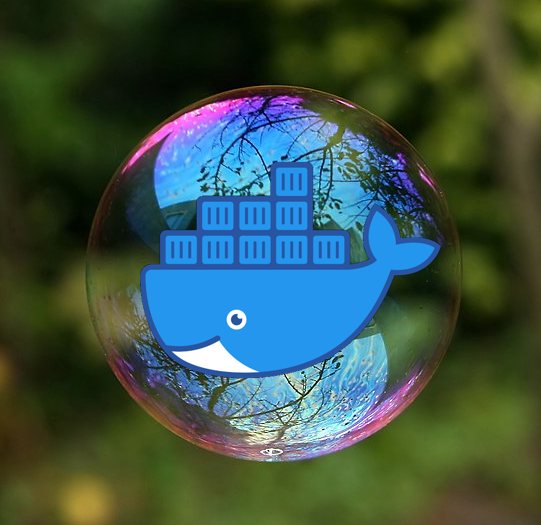
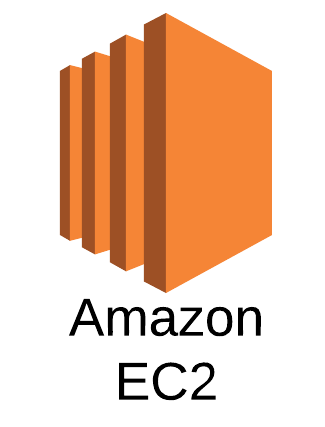
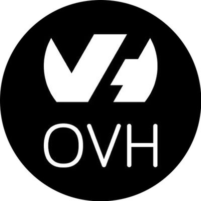

# **Fullstack Development**
### CS571: Building User Interfaces

###

#### Cole Nelson & Yuhang Zhao

---

### Before Lecture

1. Clone [today's starter code](https://github.com/CS571-F23/week14-fs-example) and run `npm install` in the starter and solution folders.
2. Download & install [Docker](https://www.docker.com/products/docker-desktop/)

---

### What will we learn today?

<div>

 - What is the software stack?
 - How can we develop a backend?
 - How can we persist data?
 - How can we use containerization?
 - What are other considerations?

</div>

---

### Software Stack



Think of software like a stack of pancakes...

[Image Source](https://www.pinterest.com/pin/looking-for-a-full-stack-developer-weve-got-you-covered--456693218441395202/)

---

### Software Stack


... where each pancake can be its own flavor...

[Image Source](https://cookingwithmammac.com/flavored-pancakes/)

---

### Software Stack

... and can be cooked its own way...


[Image Source](https://www.liveworksheets.com/worksheets/en/English_as_a_Second_Language_(ESL)/Recipes/Lets_make_pancakes_ty1088539hd)

---

### Software Stack

... with as many or as few as we want!


[Image Source](https://www.goodhousekeeping.com/uk/food/a552834/this-stack-of-pancakes-has-2500-calories/)

---

### Our Software Stack

JavaScript and React for frontend development.

JavaScript and Express for backend development.

###

When you build your project, you get to choose your software stack!

---

### Setting up your own React project!

Use [vite](https://vitejs.dev/guide/) (or similar). [create-react-app](https://create-react-app.dev/) is dead.

```bash
npm create vite@latest my-cool-app -- --template react
```

Don't forget about Bootstrap!

```bash
npm install bootstrap react-bootstrap
```

Bootstrap also [has additional setup](https://react-bootstrap.netlify.app/docs/getting-started/introduction).


---

# BadgerChat Mini
Building the UI.

---

# How to persist data?
Building a backend!

---

### Creating a Backend Server

Many, many, many options!

<div>

 - Google Cloud Functions
 - AWS Lambdas
 - C# & .NET
 - Java & Spring
 - Python & Flask
 - **JavaScript & Express**

</div>


---

# BadgerChat Mini
Building the API.

---

# How to persist data?
Let's use [SQLite](https://sqlite.org/index.html)

---

### SQLite

 - SQL, but lite!
 - Creates a `.db` file on your machine
 - Is not a "hosted" database, but is good for quick projects and hacks!
 - Handles our concurrency issues.

---

# BadgerChat Mini
Building the DB.

---

# This is great but...
...how can we deploy this?

---

# Deployment

**Generally accepted:** a server is a piece of computer hardware or software that provides functionality for other programs or devices, called "clients". - Wikipedia

###

**More cynical:** a server is just another computer with a bunch of holes in its firewall.

---

### Deployment

Run the setup commands, then...

1. Open the ports on your machine & router (or use a reverse proxy tool like [ngrok](https://ngrok.com/)).
2. Open the ports on a remote machine.

###

Still... how do we *isolate* ourselves? How do we make the environment *portable*? **Use a VM or a container!**

---




---


<br><br><br><br><br><br><br><br><br>

<sub><sup>[Image Source](https://cto.ai/blog/docker-image-vs-container-vs-dockerfile/)</sup></sub>

---

# BadgerChat Mini
Creating and deploying the image.


---

### Backend Server Hosting

<br><br><br><br><br><br><br>

<sub><sup>Not an endorsement of any particular service.</sup></sub>





---

### Other Considerations

 - Use [Jenkins](https://www.jenkins.io/) or some other CICD platform to create a [build and deploy pipeline](https://www.yooutube.com/watch?v=x9l6yw1PFbs).
   - Include testing as an automated step.
 - Use HTTPS for a secure HTTP connection.
   - Consider [LetsEncrypt](https://letsencrypt.org/).
 - Buy a domain name?
   - Completely optional!
---

### What did we learn today?

<div>

 - What is the software stack?
 - How can we develop a backend?
 - How can we persist data?
 - How can we use containerization?
 - What are other considerations?
 
</div>

---

# Questions?
